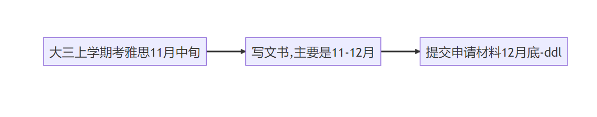

# [SE]20-电子-陈依航-KTH 3+2

## **个人基础背景**

|  |  |
| --- | --- |
| **东大GPA** | 3.87/4.8 均分 88.7（申请时） |
| **出国GPA** | 3.73/4.0 （申请时） |
| **TOEFL/IELTS** | 总分 ：7.0 阅读：7.5 听力：8 口语：5.5 写作：6 |
| **GRE** | 无 |
| **科研** | 两段校级srtp |
| **竞赛** | PLD竞赛校级三等奖 |
| **交流经历** | 无 |
| **实习经历** | 国内两段实习（一个月） |
| **荣誉** | 校级三好学生 各种奖学金 |
| **推荐信** | 两位东大电子学院的教授 |

## **录取结果**

| 学校 | 项目名称 | 录取结果 |
| :-- | --- | --- |
| KTH | 3+2 Embedded Systems | AD（无奖) |

## **申请季时间线**

## **个人感悟**

**Q: 为什么会选择出国 ？**

简单来说就是疫情期间有点疲惫了，想看一下不同的风景。为什么会选择瑞典的3+2的话也是基于此，欧洲实在是一个太适合旅游的地方了，去旅游的同时顺带去学习一下2333。时间优势也是一个我挺看重的因素，建筑的同学还没本科毕业呢，3+2已经研究生毕业了，节省了很多时间，也给自己留下了一定的退路

**Q: 为了这个目标自己做了哪些规划和努力？**

呃，好像没啥规划，是半路出家的，大一大二学习的都比较努力GPA还算够看就一直这么下去了

**Q: 四年的时间线是怎么样的 ？**

大一大二认真学习！大三上考了个雅思之后基本就没啥了

**Q: 申请季的感悟 ？**

太多了单开一个话题吧（笑

**Q: 以后的规划?**

现在还没定下来，毕业了如果有老师愿意收我的话可能想去读一个工业博士呜呜然后再工作（回国还是呆在那呢？）。关于是否永润这个问题也还没有定论，感觉一切的一切都要去那边生活学习一段时间再做考量

**一些杂谈**

我了解的资料主要是在欧陆硕士的申请，这里把我搜集到的一些资料和攻略放在这里（希望对大家的选校和决策有所帮助）

**这里把前几届3+2学长的飞跃手册汇总了一下：**

https://suhan2001shi.gitbook.io/seu2022-jie-fei-yue-shou-ce/dian-zi/se19-dian-zi-lv-ze-yang-3+2-kth#ge-ren-gan-wu 19-电子-吕泽阳学长

https://suhan2001shi.gitbook.io/seu2022-jie-fei-yue-shou-ce/cai-liao/se18-cai-liao-liu-yi-cheng-kthms （写得非常全面和详细，强推！！！）

18-材料-刘奕成学长

https://www.yuque.com/2020seufly/guide/hoszbl 17-吴院（信息方向)-包绎成学长

**一些值得推荐的B站up主**

北欧教父！ **Marcsims**

17年3+2的学长 **王小明想起个名字好难**

**留学的意义？**

https://www.zhihu.com/question/20830287/answer/50806441

他们写的申请季攻略已经足够完善和精美了，但是随着完全放开，有一些变化是值得注意的（好坏皆有）：

1.关于申请的bar，在我今年的申请过程当中，明显感觉卷度在逐渐提升，无论是全奖的bar和录取的bar都有所提升（简单来说就是更卷了），所以要申请kth的话尽量还是稍微把分刷高一点吧（嵌入式的话85肯定够用了）

2.然后也是和放开有关的，居留卡的有效时间好像变短了，从原来的两年现在只能申请一年的，也就是说到瑞典还得去延长。注意自己申请时候卡里的钱，可能也会有所调整，我今年是大概9500左右瑞典克朗，较前几年学长的8500左右克朗是有所提升的

3.机票问题，这肯定是带来的优势啦。还是注意要提前买，外加看有没有留学生行李的加成。（ps：机票东大好像给报销，这个挺香的）

**3+2的优势**

优势就是申时间，一年时间就是赚！！！等我读了一年再来补充

**3+2的劣势**

等我读了一年再来补充

祝各位学弟学妹们都能去自己想去的地方，如果有3+2的问题想交流的话可以+我的联系方式 qq:3139296996

Ps：等我先读一年再来补充（手动狗头

、

