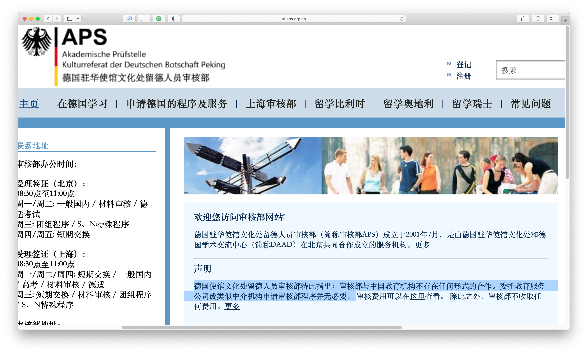
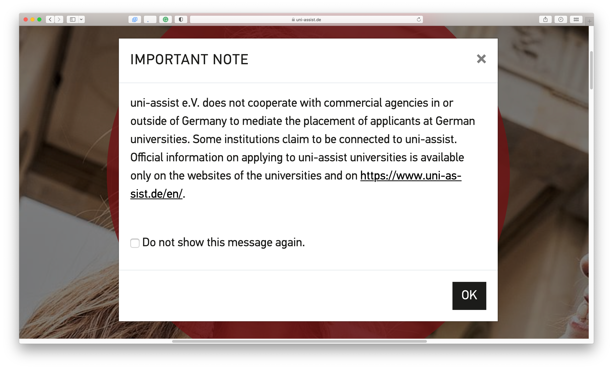

# [DE]19-生医-薛以奇-去向待定-专业待定-MS

**德国生物医学工程硕士申请** **Medizintechnik Master in Deutschland**

**个人基础背景**

|  |  |
| --- | --- |
| **均分** | 87.26/100 |
| **GPA** | 3.72/4.0 |
| **IELTS** | 总分：7.0 阅读：7.5 听力：8.0 口语：6.0 写作：6.0 |
| **GRE** | 语文：144 数学：169 写作：3.5 |
| **科研** | SRTP国创（生物材料）、毕业设计（X射线成像） |
| **竞赛** | 生医工省赛（图像处理） |
| **交流经历** | 无 |
| **实习经历** | 医疗器械外企实习（非研发岗） |
| **荣誉** | 无 |
| **推荐信** | 东大老师平推 |
| **德语** | A2（未申请德语授课项目） |
| **APS** | 1.9, eingeschränkt |

**录取结果**

| 学校 | 项目名称 | 录取结果 | 时间线 |
| --- | --- | --- | --- |
| Uni Tübingen | MSc/PhD Neuroscience | Ab | 11月申请，1月材料拒（后面有笔试和面试） |
| UBC | MEng Biomedical Engineering | REJ | 1月申请，6月底拒 |
| TU/e | Electrical Engineering | AD无奖 | 1月底提前申请，4月底截止，2月初录 |
| TU/e | Biomedical Engineering | REJ | 1月底提前申请，4月底截止，3月初拒 |
| KTH | Medical Engineering | AD无奖 | 1月底申请，3月底录 |
| LMU | Neuroscience | Ab | 2月申请，4月材料拒（后面有面试） |
| Uni Bonn | Life Science Informatics | ? | 2月底申请 |
| RWTH | Biomedical Engineering | Zu(补10ECTS) | 2月底申请，4月中旬录 |
| RWTH | Electrical Engineering and Information Technology | Ab(缺43ECTS) | 2月底申请，4月底拒 |
| Uni Heidelberg | Biomedical Engineering | Ab | 3月中旬申请，5月底拒 |
| Uni Tübingen | Neural Information Processing | Ab | 3月底申请，4月中旬拒 |
| Uni Ulm | Cognitive Systems | ? | 4月初提前申请，5月中旬截止 |
| FAU | Computational Engineering | Zu | 4月中旬申请，7月初录 |
| FAU | Medical Engineering (Medical Imaging and Data Processing英授) | Zu | 4月中旬提前申请，6月底截止，6月中旬笔试，6月底录 |
| Uni Heidelberg | Scientific Computing | Ab | 4月底提前申请，6月中旬截止，6月底拒 |
| Uni Tübingen | Biomedical Technology | ? | 5月初提前申请，6月中旬截止 |
| Uni Göttingen | Bioinformatics | Ab | 5月中旬申请，5月底笔试，7月初拒 |
| TUM | Biomedical Engineering and Medical Physics | ? | 5月申请 |
| TUM | Neuroengineering | ? | 5月申请 |
| TUM | Radiation Biology | Ab | 5月申请，6月底面试，7月初拒 |
- 德国学校没有无奖、半奖、全奖之分，表中使用Zu（Zulassung）表示录取，使用Ab（Ablehnung）表示拒信。时间线中“申请”默认为卡点申请，申请时间与截止时间相近。

**个人感悟**

我的申请是相对小众的选择，选校对大家不会有太多的参考价值。从申请结果列表中可以看出，我选择了三所德国之外的学校（KTH、TU/e、UBC）作为备选，成功申请到的KTH和TU/e都已经过期了，没有交钱。

总体上主申德国，选择德国的原因是免学费、医疗器械相关产业发达工作机会丰富、生活成本（目前）较低、移民政策（目前）利好、中德关系（目前）稳定。在德国的选校原则是地域优先（经济发达地区优先）、专业其次（电类码类优先）、学校凑活（不好的学校也没申）。我在德国的选校全部位于前西德地区，包括：拜仁州的首府慕尼黑、西门子医疗总部埃尔兰根；巴登-符腾堡州的海德堡、图宾根、乌尔姆；北莱茵-威斯特法伦州的亚琛、波恩；以及下萨克森州的首府哥廷根。除了根据地域决定是否申请之外，我还仅申请了与姜婉舒同学同时有喜欢的专业的城市，因此选校应该没有什么参考价值。当然，德国教育的高度平均化，如果不考虑博士阶段的科研水平，仅仅读本科和硕士的话，一般认为德国不同学校之间的差距不大。此外，我并没有选择德语授课专业，而是选择更容易毕业的英语专业，这样我就可以慢慢学德语，减小学业压力。

以下是一些经验分享，注意我只能保证这些分享适用于Wintersemester 2023/24（WS 23/24），之后的同学还需要自行查询以求证实际情况。

**一、德国留学（硕士）时间线和花费**

1. 申请准备
    1. 英语（TOEFL/IELTS）/德语语言考试（TestDaf/DSH）（语言证书通常在申请时就是必要材料，有少部分学校要求在入学时提供，但事实上我们最晚在申请签证时需要提供语言证书）（2000 CNY左右，取决于选择什么语言考试）
    2. [APS审核](https://www.aps.org.cn/zh/)（**拿到6个学期成绩单之后可以报名，APS证书是部分学校申请的必要材料**，排队时间可能很长，请尽早申请，另外一些学校要求入学时提供APS证书，但事实上我们最晚在申请签证时需要提供APS证书）（2500 CNY）
    3. GRE考试（WS 23/24我申请的专业中，RWTH的部分专业要数学成绩，TUM的数学系和计算机系的专业要数学和写作成绩，今年TUM突然要求写作4.0，我考了两次都没过就放弃了计算机系的专业）（1665 CNY）
    4. 文书写作（简历、动机信、推荐信、课程描述，尽量在申请季的4月之前完成所有文书）
2. 申请季
    1. 最早的一批通常是马克斯·普朗克学会的直博项目（一般写作MSc/PhD）。由于马普学会没有授予学位的功能，这种项目开设在不同的大学，和其他项目一样可以在大学官网找到，截止日期在申请季前一年的11月–12月左右，不过这种项目一般就随便申一下，看看拒信长什么样子就完了。
    2. 据我所知正常的硕士项目中申请截止最早的是卡尔斯鲁厄理工学院（KIT），他的国际学生申请截止日期通常在申请季1月，如果你考虑KIT需要尽早准备。
    3. 除了KIT，后续有一批较早的学校截止日期会在2-3月，比如亚琛工业大学（3月1日）。很多大学，如慕尼黑大学（LMU）没有统一的截止日期，不同专业的截止时间相差很远。
    4. 4月份大部分的大学都会在这个阶段开放申请，申请季正式打响，截止日起一般在6月-7月，例如慕尼黑工业大学的截止日期基本都是5月31日，还有很多学校的截止日期是7月15日，网申一般在这个时候彻底结束。
    5. 网申结束之后很多学校还有二轮甚至三轮选拔，你有可能在第一轮被直接录取、直接拒绝、或者被通知进入第二轮。这些选拔一般发生在提交申请之后的1–2个月之后（1个月算很快的），选拔的形式一般有线上笔试、电话面试、视频面试等。德国大学一般会提前1周通知测试的具体时间。
    6. 绝大部分德国大学是不需要申请费的，在学校官网申请且没有数量限制，学校内部可能有申请的专业数量限制，如至多申请3个或至多申请9个硕士项目（一般都够用）。有小部分专业则通过[uni-assist](https://www.uni-assist.de/en/)申请，在uni-assist上的第一个申请花费75 EUR，后续每个申请花费30 EUR。另外，非欧盟学生申请TUM前需要在uni-assist上完成材料预审（[VPD](https://www.tum.de/en/studies/application/application-info-portal/uni-assist)）作为申请时的必要材料，VPD是在uni-assist上申请的。
3. 行前准备
    1. **[APS补审](https://www.aps.org.cn/zh/verfahren-und-services-deutschland/chinaverfahren/nachzertifizierung)**是就读硕士的同学申请签证的必要材料（1000 CNY）
    2. 自保金（Sperrkonto, Blocked Account）是申请签证的必要材料，自保金账户中的钱会在到达德国后每个月返还给你作为生活费，由于目前自保金业务都由商业公司运营，开自保金账户会产生开户费（100 EUR左右）、月费（每月几EUR）和银行转账费。目前自保金的金额为每月934 EUR，即我们需要准备11208 EUR作为第一年的自保金。
    3. 短期医疗保险（旅行医疗保险，或称递签险）是申请签证的必要材料（保障到达德国和注册入学法定医疗保险生效期间的医保），无限期的法定医疗保险（部分大学要求学生只能使用公立医疗保险）是注册入学的必要材料。大部分保险公司会赠送递签险。目前，法定医疗保险的花费为每月120 EUR左右，取决于选择什么保险公司和套餐。
    4. [签证文书写作、材料准备和递签](https://www.aps.org.cn/zh/verfahren-und-services-deutschland/visum-fur-deutschland)（签证表、简历、动机信、高中毕业证、本科毕业证、本科学位证、APS证明、自保金证明、短期医疗保险证明等）（长期居留的签证费为75 EUR）
    5. 注册入学（需交第一学期的学期费，一般为100–300 EUR）

除了以上列出的费用，去德国留学还需要的费用是参加上述考试产生的差旅费，前往德国的机票费，到达德国后开户后即可使用保证金中的钱。此外，还需APS或学校要求提交公证书时的公证费，一份材料英语公证的价格在200 CNY左右，公证需要预留至少一周。如果没有特别的说明，德国留学材料一般只需要公证（notarize），不需要单认证（外交部认证）或双认证（外交部认证和领事认证）。领事认证的时间很长，如果需要请早做准备。

**二、申请准备**

**2.1 APS审核**

APS审核首先需要寄送6个学期成绩单等材料，进行材料审核。材料审核通过之后会通知审核面谈。审核面谈先笔试后面试，笔试围绕专业内容出题，面试通常根据笔试内容和成绩单进行更深层次的提问，面谈语言可以选择德语或英语。APS面谈之前会签保密协议，因此请大家不要问我面谈内容，网上能搜索到的资源也非常有限。如果平时是认真学习的，通过审核面谈不是什么难事。每人有3次审核面谈的机会。

**2.2 课程描述**

RWTH和TUM等学校会要求课程描述是由学校出具的，我在一些留德公众号上看到过RWTH由于课程描述缺乏公信力发拒信。因此大家需要考虑**课程描述盖章/签字**的问题，要么你们学院有一个不错的教务老师，要么只能考你和家里的人脉了，至少对我而言这个盖章的过程很不顺利。同样，由于我有过转专业的经历，APS审核需要提交录取花名册和转专业证明，当时在学校办这些证明的翻译也是非常的困难，现在档案馆应该不给翻译这种材料了，只能自己让翻译机构翻译或翻译公证。SEU目前的办事流程对需要办理这些材料的人很不友好。

**2.3 选校**

选校是困难的一步。首先你可以在德国学术交流中心（DAAD）上搜索关键词，了解大致的专业情况。我自己的做法是对所谓的排名榜单上的学校（我们常说的U15、TU9、QS前几百名）、还有我最想去的拜仁州所有学校名单（你也可以选择其他你想去的州查看所有学校）遍历一遍，我查看了所有这些学校的专业列表，对疑似相关的专业点进去看课程描述，最后找到符合我的要求和兴趣的专业。这个过程对生物医学工程的学生来说非常痛苦。有时候能搜索到专业Biomedical Engineering/Medical Engineering/Medizintechnik，但更多时候生医隐藏在大类的分支中，例如RWTH的Electrical Engineering and Information Technology中的Biomedical System Engineering，KIT的Electrical Engineering中的Biomedical Engineering，这些分支都无法通过搜索引擎或者DAAD检索到，只能靠自己手动一个一个查看课程描述和录取标准。当然，会发生这种情况仅仅因为我的专业比较抽象，而且留学目的地比较局限，只能尽量在这个区域内搜索出尽可能多的相关专业。大部分传统学科的同学应该不会碰到这样的问题。但是，介于现在学校正在搞出越来越多的“交叉”专业，我所说的这些不乏对一部分同学有帮助。

**2.4 不找留学中介**

参见以下两个德国官方机构的说法：

**三、申请**

德国申请一般比较最看重课程匹配度，然后看均分、文书和笔试/面试结果。

其中，RWTH的申请完全不看均分和动机信之类的文书，只看课程匹配度且一般没有人数限制，多少人匹配度达标就收多少人（宽进严出）。一般申请德国学校需要填写一张匹配度表格，用自己所学的课程学分去对应大学要求的学分。RWTH给我发的拒信中有详细的列出我缺了哪些学分，完全符合录取规则（Zulassungsordnung）里面写的流程进行的，让人心服口服。当然，大家也不要因为自己预估的匹配度不够而不敢申请，即使是最看重匹配度的RWTH，一般也只是热门的传统强势学科例如机械工程、电气工程非常重视匹配度且完全根据录取原则进行，另外一些冷门的或者新兴的专业的申请可能只是“看起来很重视匹配度”，实则你不知道他们看的是你的本科背景、均分还是别的什么。RWTH的录取流程很精简，只有一轮，且只看成绩单，不需要动机信、推荐信之类的复杂文书。

另一类学校比较“现代化”，习惯把主动权掌握在自己手里。例如FAU，他的官网上写的录取要求是“需要一个相关的本科学位”，我发邮件问了这是什么意思，得到的答复是“需要一个相关的本科学位”，最后如果被拒了，理由一般是“你的本科学位不相关”。这种黑盒录取就更不要犹豫了，申请了再说呗，反正不要钱。

剩下一种是选拔占很大比重的学校，例如TUM。TUM的录取方式分为两轮，第一轮材料审核，决定你是被直接录取、直接拒绝或是进入下一轮筛选，而下一轮筛选通常是面试。FAU的Medizintechnik专业的二轮筛选在今年第一次加入笔试，以后可能成为常态。而TUM据我所知一般国际学生不太可能在第一轮被直接录取（匹配度绝对比不过欧本），因此基本上都是靠面试决定是否录取。

**四、行前准备**

我目前还在等待学信网证明用于APS补审，在飞跃手册截止日期（7月9日）前APS补审、签证、注册、到达德国等工作我还都没有完成。希望以后有机会来填坑。

**五、备选国家申请**

除了申请德国之外，我还申请了瑞典KTH、荷兰TU/e、加拿大UBC三所学校备选。这里也简单介绍一下这些申请。

瑞典申请使用全国统一的系统（[www.universityadmissions.se](http://www.universityadmissions.se/)），总共能报4个志愿（根据观察**非平行志愿**），最终最多只会给一个录取，后面的申请作废。瑞典申请费为一次头交900 SEK。由于是全国统一的系统，申请体验很好，除了广告有点多。KTH是一个很好的保底选择，在6月之前需要交第一学期的学费，在开学之前如果放弃入学，还可以退还所交第一学期学费的85%，相当于是不太昂贵的保证金。不同项目的学费略有差异。

荷兰申请同样限报4个志愿（部分首先专业如医学只能报两个，我不太了解这一块）。TU/e的申请需要在Studielink（**注册需护照**）上面填写申请，然后再在学校官网上填写申请。TU/e的申请费为每个项目100 EUR（而且比较坑只能银行转账，很多手续费）。TU/e的申请周期很长，从申请季前一年10月开放一直到申请季当年5月，会在截止日期前录取，但是在6月之前交第一年的学费（17000 EUR），因此不太适合拿来保底（这个交钱时间应该能保住其他国家，但还是太早保不住申德国的同学）。

加拿大的UBC如果不是真心想去加拿大建议大家就不要申请着玩儿了。有以下几点原因：

1. 申请费很贵，186 CAD；
2. 推荐信需要3封（对于欧陆来说是多的）而且老师填写推荐信的系统非常复杂，有的老师人好自己填得很认真，填完都说太烦了；
3. 等待时间太长了，也不拒也不waitlist就养鱼，1月15日截止的申请一直到6月30日才发了拒信，整天休假的德国人回应都没那么慢。而且中间完全没有过任何提醒，大部分德国学校等的时间长了起码能收到邮件提醒或官网上的加入“我们最晚会在什么时候答复”之类的话语，而且那些都是不要钱的申请。UBC等了几个月都没反应时我就已经有数录不了了，就是在等拒信什么时候来，结果一下等到了6月底！和欧陆的申请相比，这个186 CAD的申请体验太差。xxx，退钱！

这里并不是说UBC是不好的学校，但是不适合作为备选申着玩，只建议目标就是加拿大或者非常优秀不会被养鱼的人申请。

**六、感悟**

目前还没有确定去向，希望之后有机会来填坑。特别感谢姜婉舒同学和我一起度过这个申请季！因为生物医学工程申请的每个专业都不太一样，基本上没有能重复使用的动机信。我们都没有找中介，文书就是自己写、ChatGPT帮忙、互相看、让身边的人看。这个申请季非常的辛苦，希望后面还能拿到一些Zu，并顺利前往心仪的城市学习生活。

关于生物医学工程专业在德国的申请情况，我还能够给出很多更加具体的建议，这些复杂的信息（例如成绩单上的课程和学分、学校的匹配度表、RWTH Zu上的补课单、Ab上的缺课单、以及各学校具体的录取流程）在此就不赘述了。如果有任何问题，请不要犹豫联系我richie37xue@outlook.com，richie37xue@gmail.com。Viel Erfolg!
