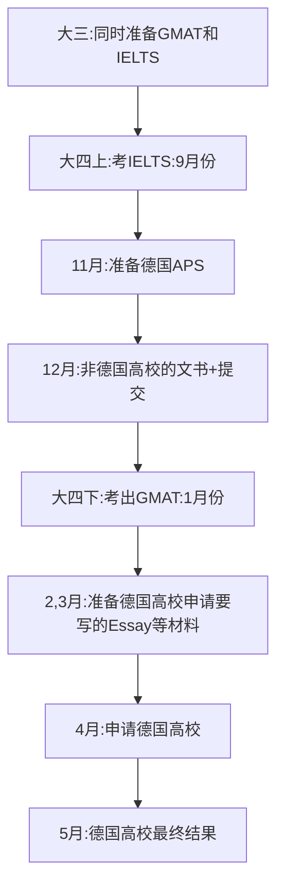

# [Germany]19-经管-刘一-TUM-MMT-MS

**选择适合自己的，把握自己的申请！总会有梦想成真之日！**

## **个人基础背景**

|  |  |
| --- | --- |
| 东大GPA | 3.783/4.8 |
| 出国GPA | 89.88/100 |
| IETLS | 总分：7；阅读：8.5；听力：7.5；口语：6；写作：6.5 |
| GMAT | 总分：700；语文：37；数学：49；写作：4.0 |
| 科研 | 一段科研经历，校级重大SRTP |
| 竞赛 | 互联网+，校庆杯等，参加的竞赛比较少 |
| 交流经历 | 申请到了大四上港理工的学期交换，但是因为疫情原因放弃 |
| 实习经历 | 三段较软的实习经历（不过实习对欧陆申请影响不大） |
| 荣誉 | 三好学生；互联网+省赛金奖；各类奖学金+课程奖接近2w |
| 推荐信 | 东大教授*2 |

## **录取结果**

| 学校 | 项目名称 | 录取结果 | 个人评级 | 时间线 |
| --- | --- | --- | --- | --- |
| TUM | MMT-MS | AD（无奖) | 梦校/平级 | 4.1 Submit, 5.23 Admit |
| TUM | FIM-MS | REJ（匹配不够） | 彩票 | 2.28 Submit, 5.2 Reject |
| KUL | BISE-MS | AD（无奖） | 保底 | 11.23 Submit, 3.2 Admit |
| TU/e | OML-MS | AD（无奖） | 保底 | 12.10 Submit, 1.27 Admit |
| EIT-KTH+TU/e | SUMT-MS | AD（小奖） | 平级 | 11.23 Submit, 3.30 Admit |

## **申请季时间线**

## **个人感悟**

选择出国有太多的原因，这四年经历了太多的事情，申请的过程也十分的精彩，但总算最终的结果非常不错，拿到了自己的梦校想去的专业的录取。我想从学校选择、语言、申请遇到的问题出发。

### 出国的想法与地区选择

最开始出国的想法还是由我对象提出，后来仔细考虑也确实觉得年轻的自己应该出国去看看，感受不一样的文化，我和对象也一起为此努力。我的舍友也给了我很多的帮助。我们都是放弃保研出国，我准备IELTS+GMAT，他准备TOFFL+GRE，虽然没有准备一样的东西，但是总算是有很多可以交流的空间。出国首先要选择地方，这取决于很多东西。美国对我来说过于昂贵，本身自己也不喜欢类似英国的一年制硕士，所以欧陆就是我最好的选择。在欧陆的国家里面，德国荷兰瑞典比较好留下，其它国家就相对没那么好留下工作，我想毕业以后至少在当地工作一段时间，所以这几个国家的高校和项目就是我申请的主要方向。虽然我的本科专业是经管学院的，但是欧洲很多高校的物流专业都是属于工科，总之可以操作的空间很大，申请的项目也非常综合。

### 语言是出国留学的重要因素

这里的语言指语言+G成绩。大学开学时候我的英语非常一般，二级起点。所以在准备语言和G的时候十分花费力气，加上疫情GMAT考试经常取消或者约不到，这一项花费了我很久的时间。我基本上是雅思-GMAT-雅思-GMAT的时间进行准备。GMAT对英语的提升很大，让雅思变得十分轻松。最后两个考试出成绩都在大四，也算是综合积累以后达到了需要的水准，成绩就出来了。GMAT和GRE考试要看自己申请的专业，我所申请的泛商科专业可能都有对G的要求，要想好最大化收益，比如，我最想去的项目要GMAT，但是有一些项目要GRE，那可能就需要自己放弃GRE。建议是只考一个。按照我跟舍友的交流，我见解是，这两个考试，GMAT考逻辑，GRE考词汇。所以可能会出现一些情况，例如，精心准备以后，GMAT考试比上次还要差。一般GRE这种情况少一些，因为准备GRE过程中词汇量上去了，分数上升的可能性更大。

### 相对麻烦的欧陆申请

德国的申请还需要APS和VPD，以及面试、笔试、Essay等。APS是德国审核部对你“学历真实性”的一次审核，需要在上海线下面试+笔试。排队时间相对长，尤其是高峰时期，但是对于985的学生，尤其是好好学习以后的学生来说，APS还是很容易。VPD是线上的文件真实性审核，可能也需要１－２个月的时间，一些德国高校需要VPD，例如慕尼黑工大（TUM）。面试、笔试和Essay则取决于不同的项目，慕工大的MMT（Management and Technology）专业要写Essay，也就是一篇小论文。FIM专业在申请过程中第二阶段也要面试。慕尼黑大学的MMT则面试、笔试和Essay都需要。这些过程非常麻烦，而且时间线拉的很长，也是为什么几乎慕尼黑大学的MMT没有一个中国人的原因。课程匹配也是非常麻烦的事情，德国十分看重课程匹配，我为了TUM的申请，多选了三门选修，两门同院其它专业的正式课程，一门重修，所以这些事情一定要提前准备。

### 学校与专业的选择

本科的专业虽然叫做“物流”，但是内核是建立数学模型→编程/仿真软件→求解现实问题。所以我们的课程学了非常多的运筹、建模编程等相关内容。这在欧洲，相匹配的专业叫做“商业信息学”。所以申请的时候，我的选择都是管理学+工程学科紧密结合的。在我的选择的下，基本上都可以选择偏信息系统、数据科学等方向作为一个major的track，这些项目都是我觉得会跨出纯“管理学”范畴的综合学科。这里我还申请了EIT的一个项目，Urban Mobility是偏交通的一个项目，这里可能由于985+90分的背景，拿到了75%奖学金（18w），算是一个非常好的结果。单位最终选择TUM，因为大学的各项准备都是为了TUM的MMT而准备，对于这个录取也算是情理之中。（顺便说一下，TUM下学期开始收学费，这对我们这一届十分有利，但性价比对于23fall以后的同学来说相对就降低了）

总之，无论是哪个国家，都有自己相应的困难，但无论自己的情况和起点如何，只要为之努力，一切都会达到自己理想的结果。自己把握自己的申请，随时了解申请的状况，加油，飞跃er！