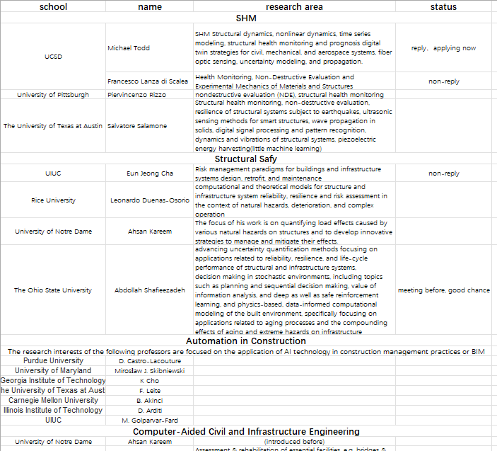

# [US]18-土木-林海巍-UCSD-Structure Engineering-PhD

# **[US]18-土木-林海巍-UCSD-Structure Engineering-PhD**

**“天坑专业”土木的PhD之路**

## **个人基础背景**

| 东大GPA | 不记得 |
| --- | --- |
| 出国GPA | 3.61/4.0 |
| TOEFL/IELTS | 有国外MS学位，免除语言要求 |
| GRE | 语文：147数学：169写作：3.5 |
| 科研 | MS期间和国外老师做的毕设和MS课题，本科期间两端科研经历+专利。 |
| 竞赛 | 两三个国家奖项，两三个省奖，差不多了。 |
| 交流经历 | 参加东大土木和nus的311项目，大四期间在nus学习和做毕设 |
| 实习经历 | 无 |
| 荣誉 | 秋奖，校三好 |
| 推荐信 | 两个东大教授，一个NUS教授（MS的导师） |

## **录取结果**

| 学校 | 项目名称 | 录取结果 | 个人评级 | 时间线 |
| --- | --- | --- | --- | --- |
| UCSD | Structure Engineering PhD | AD(全奖) | 冲刺 | 12.01 Submit, 1.18Admit |
| OSU | Civil Engineering PhD | AD(全奖) | 保底 | 不记得,在UCSD之后 |
| Umich | Civil Engineering PhD | Rej | 冲刺 | 12.01 Submit, 4.14 Rej |

（PhD的录取学校不重要，重要的是导师和组，弱校牛导一样是彩票）

## **申请季时间线**

相对比较赶，托福和GRE建议早些时候考出来。申请季专心套磁和文书。

## **个人感悟**

与其他的同学不太相同，我是在NUS读完了MS之后申请的PhD。而PhD申请与MS申请有很多不同的地方，我想借这个机会给大家讲讲。

### **1.明确读PhD的动机**

首先，明确自己为什么要读PhD。PhD不同于大多数上课就结束了的MS项目，它是需要踏踏实实地进行科研，并且淘汰一部分人的。在读PhD之前一定要做好心理准备。如果有想读PhD的念头，建议参加一些科研项目感受一下，再好好地做决定。

就我个人而言，我其实很早就明确了PhD的目标。原因主要有三：①我其实一直都想去世界最顶级的平台，拓宽自己的视野，结识更多的人。但不得不考虑自己家庭的经济因素。而PhD几乎都是全奖，对于家境一般的人来说是一种实惠的出国方式。如果想通过读书来看看世界，PhD是一个很不错的选择。②我读的是土木，也是一般人认为的天坑。读完MS之后，我觉得自己不太能找到适合的工作。但由于沉没成本太高，加上其他的专业估计读出来没啥竞争力，所以也不是很想转行，便想一条路读下去，把土木读精，就选择土木里比较前沿+交叉的方向读PhD，这样进可业界退可高校，选择面比较广。③在本科期间我就明确了自己适合科研这条道路，于是就想在这条路上继续做下去。而身边的朋友也很多在科研的道路走下去的，也有受了他们的影响把。

### **2.明确自己想要申请的方向，以及相关材料的准备**

PhD与MS最大的不同是，MS是你给学校钱学校给你文凭，而PhD是学校给钱让你读书。所以最核心的概念是：你有什么能说服学校（或者导师）给钱让你读书的闪光点。而这个闪光点，可以是你与导师的connection（比如与你很熟的一个老师把你推到他朋友的门下），也可以是你有很多的paper能让老师拍板要你，或者是你的研究方向与某位导师一拍即合，两人看对眼了就要了你。这些可以分别在推荐信，个人研究经历，文书中体现出来。所以在申请之前，你就要想好自己的研究方向，并且有一定的研究成果（主要是paper），这样才能提高申请的概率。当然，如果已有的研究成果和想申请的方向不同，也可以大胆的试试。导师自己也经常会换方向，所以他们也理解方向不可能一成不变，而你已经做的成果也是你能力的体现，也有机会获得导师的青睐。GPA的作用应该也是有的，没有人不喜欢有漂亮的GPA的学生，但相对于paper和connection来说并不那么的重要，个别牛导可能会只要年级第一那种。

至于文书的准备我给不了太多的建议，我的PS和CV是自己套了模板，然后请我的ms导师帮忙改了改，也请了NUS的local朋友帮忙润色，这种经验就推广不了了。现在倒是可以用GPT试试 :)。至于推荐信，我找到的是东大的两个老师和ms导师，而我的PhD导师也是我ms导师的朋友，所以推荐信里估计也就我ms导师的有些用处吧。

关于语言和GRE这些，则是最不重要的。但一定要尽早准备出来，不要让这些标化成绩干扰了更重要的东西。我的整个申请的流程其实非常的赶，因为我本意是做一年RA，有了paper然后申请（我到目前为止没发表过paper）。但我的MS导师鼓励我去联系试试，于是我在8月到12月的申请期间一直在准备套磁，文书，语言，GRE。还有自己的课题，忙的晕头转向。所以如果有机会，一定要早做规划。

### **3.大胆套磁，缩小目标**

套磁指的是去发邮件给潜在的导师，询问自己申请的可能性以及组里的情况。我当时主要考虑的是美国、欧洲、英国的学校。欧洲只看了ETHz和EPFL，但这两所学校的老师都没给我积极的回复，英国的学校由于给PhD学生的资金有限，所以我也只看了IC的部分老师，并没有十分感兴趣的项目。因此套磁的精力主要还是放在美国的老师身上。由于PhD是跟着导师读，因此导师的重要性大于学校。在明确了想要读的方向之后，就可以找导师进行套磁。有人觉得委员会制的学校套磁没必要，但我个人认为无论是委员会制还是导师制，套磁都是有必要的，因为套磁可以让你知道老师的情况，也可以明确自己申请的定位，从而缩小申请的范围。比如说你有一个很喜欢的导师，但通过套磁你知道这个老师组里今年经费比较紧张，他没钱去收新的PhD学生，则你就可以放弃这个老师，不用再浪费精力了。再比如说有个很厉害的导师，你觉得自己申不上他，但通过套磁你知道这个导师今年有个新课题，有经费也刚好缺人，他也鼓励你申请，你就可以大胆的试试看了（我就是这个情况）。通过套磁，我也确定了选校，极大地减少了我申请所需要花费的精力。

套磁的第一步就是要找到可能的导师，这是一个浩大的工程。如果有必要的话得把排名前几十名的学校的相关部门的官网全部浏览一遍，把导师的研究方向一个一个地看，然后把感兴趣的老师全部整理成一个excel文件，再一个个发。这工作量非常大，所以套磁是一个长期的活，不可能和发offer一下一周就发几十个老师。还有一种方法就是把自己常看的论文的期刊的编辑都浏览一下，能做期刊编辑的老师水平至少不会差，这样可以大大缩小范围。我后期就是这么做的，整理如下图所示：

我的建议是每个有兴趣的导师都发一遍，哪怕是斯坦福普林斯顿都试试，说不定就看对眼了呢。

然后，就是打磨套磁信。套磁信的内容主要就是介绍自己的情况，再讲自己对老师课题的认识，然后讲讲老师的课题怎么与自己相关（很关键，硬套也得套）。套磁信有很多的模板，现在也可以用GPT去写。关于套磁信，有些人会认为好好地写每一封更容易得到老师的青睐。我则认为得“海”，即一个模板改改方向和老师的名称就发出去，尽可能多发。我觉得如果好好写了但老师不回，会很浪费精力，并且让你没时间去沟通下一个导师。

最后，就是等回复了，套磁信的回复一般可以分为三种：①回复了，约面试。这种是最积极的，你可以通过面试来让老师和你彼此了解，如果老师觉得不错甚至有机会拿到口头offer。②回复了，鼓励申请。一般来说这是出现在一些委员会制的学校中，老师没有决定学生录取的权力，所以会鼓励学生申请，然后按流程来。这种回复比较中性，而且取决于老师个人的喜好，有的老师把这当作一种套话，每个人都这么说（俗称养鱼）。而有的老师会是确实觉得你不错，但他确实不敢保证，所以才这么说。所以当收到这种回复时，还是不要放弃机会，抓紧申请比较好。③不回，拒绝。一般而言一周之内不回复就是婉拒了（也可能老师在放假，这时就要注意发套磁信的时间了）。或者老师明确和你说自己组里今年不招PhD。这种情况建议就别申了，省点精力放在那些更值得的老师身上吧。通过老师的回复，可以明确自己的定位，比如斯坦福冲不上，UCSD可以冲冲，PSU，OSU可以用来保底。这也是多发套磁信的好处。

需要说明的是，套磁信的回复率是很低的，就我自己而言，发了30多封却只回复个位数。因此不要对每个老师都抱太大的期望，要相信自己肯定是有老师会要自己的。

### **4.和自己熟悉的老师，学长学姐多沟通**

PhD申请基本都是DIY，不找中介的很大一部分原因是，中介根本不知道你做的方向是什么。他们不可能什么专业的什么细分都弄得懂，而最懂你专业的还得是一些研究生学长学姐或者是和你熟悉的老师。如果你申请的领域恰好是老师的领域，那么这两个人也许还是朋友。最好的情况下他可以直接介绍你进组。最差也可以通过这位老师更清楚地理解这个领域的东西，方便你进一步把握文书的内容以及思考申请的方向。同时，老师和学长学姐也可以给你介绍一些这个领域的专家，让你能够缩小套磁的范围。我的博士导师就是ms导师给我介绍的，他的原话就是“He is rich”，并建议我套套磁。

### **5.保持耐心，稳住心态**

PhD的申请主打的就是一个玄学，因为你永远不知道明年的情况。也许你下一年之后自身的竞争力强了很多，但老师刚好没钱了，你就申不上了。所以我的建议是无论自己情况怎样，都要敢于尝试，说不定就能遇到一个老师看对眼了，就要了你。如果老师不要你，也要稳住心态，也可能确实你很优秀，但是老师确实没办法要你，这时把精力放到下一个老师身上就可以了。

最后，一定要敢于尝试。我由于没发过paper，在老师建议我尝试前一直不敢申请。但最后还是进了一位大牛的组，其实这样的结果是出乎意料的。因此，我建议各位有想法的朋友一定要敢于尝试。也许，下一个被梦导选中的人，就是你。