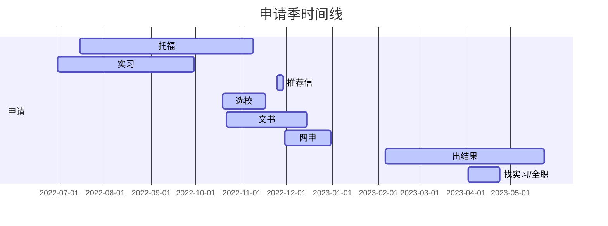
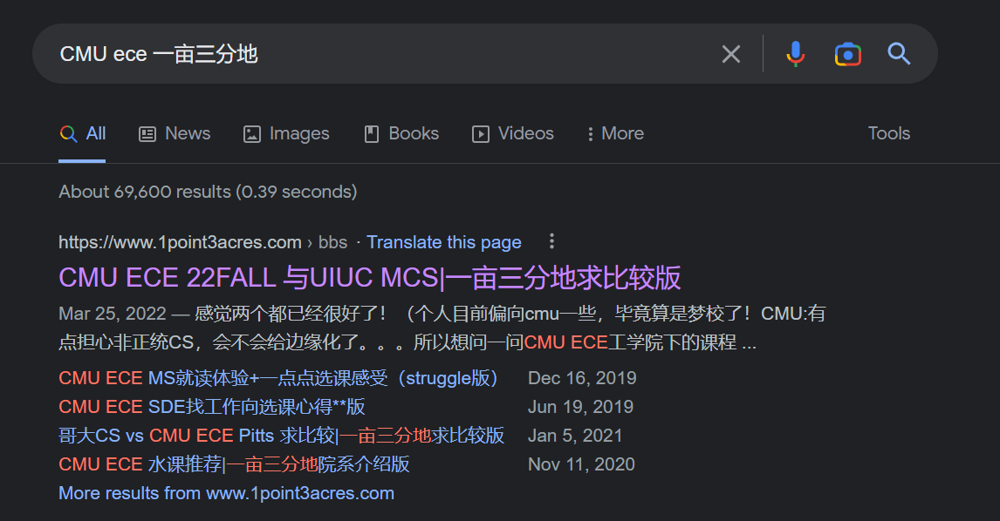

# [US]19-AI-袁一啸-Columbia-CS-MS

**个人基础背景 (和申请简历完全一致, 所以把唬人的都放上了哈哈)**

| 东大GPA | 4.1+/4.8, 具体记不清了 |
| --- | --- |
| 出国GPA | 3.92/4.0, 均分91.57, 排名2/91 |
| TOEFL/IELTS | 总分: 101 阅读: 29 听力: 25 口语: 21 写作: 26, 为家考 |
| GRE | 无 |
| 科研 | 东大+港校+腾讯 1. 本校无产出. 2. 港校remote水了几个月, 感觉课题做不出东西, 也没啥意思, 就不了了之了, 也没要推荐信, 写上去主要是为了凑数. 3. 腾讯不是正式的实习, 是本校导师介绍, 和那边导师做科研, 有一篇在投和专利. |
| 竞赛 | 1. 字节跳动安全AI挑战赛亚军 2. 腾讯觅影医学人工智能比赛季军 3. 省生物医学创新竞赛一等奖 |
| 交流经历 | 爱丁堡大学交换, 大四下才去, 所以申请的时候还没开始, 虽然写上去了, 但是估计没啥用 |
| 实习经历 | 顺丰算法实习2个月, 简历上看起来是3个月 (建议早点实习, 大厂对于申请帮助很大, 对于留美找工也有帮助, 不读phd的话做科研性价比很低) |
| 荣誉 | 华为智能基座奖学金 (三好学生, 课程奖啥的没有写上去) |
| 推荐信 | 1. 东大本校科研推 2. 腾讯导师科研推 3. 顺丰同事实习推 |

**录取结果**

| 学校 | 项目名称 | 录取结果 | 个人评级 | 时间线 |
| --- | --- | --- | --- | --- |
| UofT | Mscac | REJ | 彩票 | 04.18 Reject |
| Berkeley | EECS Meng | REJ | 彩票 | 04.13 Reject |
| UT Austin | MSECE (SES) | 材料不全 | 彩票 |  |
| CMU | AIEIS+MSMITE | REJ | 主申-冲刺 | 03.09 Reject |
| CMU | ECE+AIE | REJ | 主申-冲刺 | 04.07 Reject |
| Cornell Tech | MSIS | REJ | 主申-冲刺 | 02.06 Reject |
| UIUC | MCS | REJ | 主申-冲刺 | 03.21 Reject |
| UBC | ECE Meng | REJ | 主申-冲刺 | 4.22 Reject |
| Waterloo | ECE Meng (COOP) | REJ 转录non-COOP | 主申-冲刺 | 04.10 Reject |
| Wisc | CS PMP | REJ | 主申-冲刺 | 04.04 Reject |
| Columbia | MSCS | AD (无奖) | 主申-冲刺 | 04.13 Admit |
| Duke | ECE Meng | AD (无奖) | 主申 | 03.10 Admit |
| SFU | MPCS | REJ | 保底 | 04.25 Reject |
| NUS | DSML | REJ | 保底 | 09.30/5.24 (提前批/正式批) Reject  |
| USC | MSCS | AD (无奖) | 保底 | 03.31 Admit |
| UW | EE PMP | AD (无奖) | 保底 | 03.16 Admit |
| UCI | Netsys | AD (无奖) | 保底 | 03.11 Admit |
| Rice | MCS | AD (无奖) | 保底 | 03.09 Admit |

**申请季时间线**

**个人感悟**

## 申请相关

### 托福

虽然我自己考了很多次才勉强上100, 但也是有一些经验的. 感觉没有必要专门背单词.

- 阅读. 根据我的观察普遍都比较高, 不需要怎么准备一般都可以27+.
- 听力. 托福最难的部分, 网上很多人推荐微臣听力, 我自己也用的这个, 讲得挺好的, 但是依然需要大量练习.
- 口语. 口语差的同学强烈推荐[https://www.1point3acres.com/bbs/thread-653596-1-1.html](https://www.1point3acres.com/bbs/thread-653596-1-1.html). 考虑到我task2-4说的一塌糊涂都能21, 用save time这个模板上22, 23还是不难的.
- 写作. 提分最有效的部分! 推荐黎老师/Vince的模板, 我用了一次Vince作文26, 另一个朋友用了黎老师作文28, 之前我们都在20-22徘徊. 我个人总结就是字数不一定要多, 但是词汇一定要丰富, 很多人反应字数多得分高, 我个人推测是因为字数多了, 独立单词的数量自然也会变多.

脱产学习效率高备考时间大概1-2个月.

### 文书

文书大概可以分为通用部分+why school. 写好通用部分的故事之后只需要对结尾的why school进行微调. 目前, ChatGPT基本可以完美替代文书的工作了, 当然, 这个更多只能在语法层面进行润色, 这个核心的故事还是需要你自己去构建. 比如我的经历很多是和healthcare相关, 那么我讲的故事就是一次就医经历切入, 然后从自己接触相关领域, 一步一步深入, 最后讲出自己要结合AI+healthcare, 改善医疗条件的故事. 整体框架是不变的, 后面why school部分呢就只需要结合学校扯一点就行, 比如哪个学校医学院很好有合作机会, 对哪个相关领域教授相的研究感兴趣, 或者开设的相关课程有吸引力… 我对于文书的观点就是不求有功, 但求无过.

### 推荐信

其实这次申请我的推荐信部分做的不是很好, 如果只准备3封推荐信最好还是2封来自学术界+1封工业界,  也可以准备更多封, 根据学校偏好选择不同的组合. 像我这次申请季1封学术界+2封工业界的推荐信组合并不是很好, 因为有的学校明确说明推荐2封来自学术界, 甚至3封都要是学术界的. 硕士作用的话大概是**国外大牛强推>国外强推>>国内大牛强推~=国内强推>>弱推/黑推**, 无论是谁, 一定要避免平推/弱推, 一封国内教授的推荐信也许不会对你的申请有太大帮助, 但是平推/弱推可能会毁了你的整个申请. 如果你读phd, 国内大牛直接强推到指定导师手上, 肯定是有作用的, 但是硕士申请国内大牛的作用可以忽略, 并且你认为的大牛可能并不一定是真的大牛, 不如找个熟悉的导师写一下.

不求有功, 但求无过. 一封黑推可能毁了你的申请. 海外推荐信尤其要慎重, 一定要和对方确认推荐信强度. 对于大陆推荐信, 如果需要你自己草拟自己提交, 可以注意以下细节: 

- 删去PDF元数据. PDF属性里会有作者等信息的, 如下图. 自己草拟的推荐信要删去相关个人信息.
- 提交IP. 根据地里经验, 使用同一IP提交推荐信, 也容易被怀疑推荐信的真假. 可以用阿里[无影云桌面](https://www.aliyun.com/product/ecs/wuying), 首次使用很便宜, 正好可以用来交推荐信. [青椒云桌面](https://www.qingjiaocloud.com/), 这个按小时计费, 一小时几毛钱, 也很适合交推荐信. 如果本校的推荐信, 换台电脑提交就可以.
- 批量发送. 同时发送所有院校的推荐信, 让老师一次性把邮件转发给你, 可以少打扰老师几次.

### 社交

社交不算是申请的必备条件, 但是对我帮助真的很大. 不同于线下吃饭那样的社交, 这里的社交更多是指网上, 去和不同学校的人社交, 去和不同方向的人社交, 去和同年的申请者社交, 去和往年的申请者社交. 社交不仅仅是简单扩圈, 更是获取信息的重要手段. 这里推荐几个方式:

1. 加入当年的申请群, 看看别的申请者在做些什么, 听听他们的选校等等.
2. 本校出国群加一些本校的学长学姐, 听听过来人的经验和建议.
3. 通过小红书, 地里加一些offer holder的群, 看看别人对于项目的想法.
4. Linkedin加一些目标院校的学长学姐, 详细了解一下项目的最新情况.

其中一对一聊天信息密度非常高, 群里也有很多信息, 但人数多起来大家都爱吹水, 有效信息很容易被淹没.    

### 选校

专业名词:

CS: Computer Science

ECE: Electrical and Computer Engineering

bar: 项目录取门槛

DP: data point, 大概指项目拒录的案例

作为一名CS选手, 我这里主要是针对CS/ECE方向的申请, 有一些方法别的专业也可以借鉴.

- **CS项目总览**: [https://csmsapp.org/](https://csmsapp.org/). 北美CS主流项目基本都囊括了, CSMSAPP最好的一点就是他的分级, 可以对于各个项目的bar有个初步了解. 以前学长也做过很好的总结[美研EE/ECE/CS项目大详解 (yuque.com)](https://www.yuque.com/2020seufly/guide/kc2lu1).
- **一亩三分地**: [https://www.1point3acres.com/bbs/](https://www.1point3acres.com/bbs/). 地里集中在北美转码, 有大量真实数据, 制定选校的话可以看别人的**选校贴**, 或者去年录取的**总结帖**. 针对某个项目, 可以在地里找到**体验贴/比较贴**, 一般我采用如 ”[学校] [项目名] 一亩三分地” 这样的关键词在Google搜索.
  
    
    
    这里推荐一个Telegram频道: [https://t.me/usgradapplication](https://t.me/usgradapplication), 这个频道从地里爬取了所有录取数据, 我的用法一般是针对具体项目, 搜索拒录dp, 通过看大量近几年的录取发放情况, 可以对项目bar有个更清楚的了解.
    
    
    
    但是有的时候我们发现并没有背景描述, 我们可以点击 ”主题”, 查看楼主的过往发帖记录, 也许可以看到楼主其他录取情况和自身背景.
    
    
    
- 寄托天下院校库: [https://schools.gter.net/](https://schools.gter.net/). 这里主要是欧洲的一些dp, 不需要充值会员就可以查看, 界面也很友好.
- 知乎. 知乎每年都有申请相关问题 (如[2023 Fall 你都申请了哪些学校的 MA/MS/PhD/JD/MD/MFA，录取结果如何？](https://www.zhihu.com/question/360515552/)),  但是大部分回答都是PhD选手. 当然, 知乎也会有一些零星的申请总结文章.
- 小红书. 小红书留学相关信息真的丰富. 也可以看到一些别人的选校定位.

### 项目评价及信息

我自认为自己对于EECS申请还算了解, 收集的信息比较多, 加上今年顺便做了几个留学选校定位的咨询, 所以也收集了一些学校的信息和自己的评价, 分享出来. 前面是美国, 然后是加拿大, 最后是港新.

| 项目名称 | 录取信息 (这里的背景大部分都是低于录取平均水平的, 反正差不多都可以申请试试) | 个人评价 |
| --- | --- | --- |
| CMU MSIN/MSMITE | 23fall 211 87/3.5 [link](https://www.1point3acres.com/bbs/thread-975865-1-1.html) 23fall 华五88/3.6 [link](https://www.1point3acres.com/bbs/thread-975791-1-1.html) | INI是CMU的就业顶级项目, 仅次于CS学院, 比ECE好, 但是回国的话体制内可能会因为专业名有一些隐患, 互联网不用担心. 这个项目课程非常好, MSMITE有1-2门偏嵌入式一点的课程, 但也还好, MSMITE第二年在硅谷. MSMITE bar略低. [link](https://www.1point3acres.com/bbs/thread-974691-1-1.html) [link](https://www.1point3acres.com/bbs/thread-955470-1-1.html) |
| CMU MSIM | 23fall 华五3.6 [link](https://www.1point3acres.com/bbs/thread-978303-1-1.html) | 这个项目很软, 各方面都不错, 尤其适合商科转码. |
| CMU AIE | 23fall 华五3.65 [link](https://www.1point3acres.com/bbs/thread-980553-1-1.html) | CMU去年开了很多AI+X, 机械, 生物医学, 土木等录取门槛不高, 但是相应要学一些那边的专业课. |
| CMU ECE/SVSE | 23fall 华五88.3 3.86 [link](https://www.1point3acres.com/bbs/thread-973900-1-1.html) 23fall 985 3.79 [link](https://www.1point3acres.com/bbs/thread-973926-1-1.html) | 两个项目一起申请, 分志愿优先级. 23fall ECE录取人挺多的, 目测bar降低了. 纯软项目. 也会发defer spring的offer. SVSE在硅谷. |
| Columbia EE/CE | 23fall 211中外 3.6/88 [link](https://www.1point3acres.com/bbs/thread-980975-1-1.html) 23fall 华五3.78录取奖学金 [link](https://www.1point3acres.com/bbs/thread-971460-1-1.html) 23fall 985 3.76/85.5 [link](https://www.1point3acres.com/bbs/thread-977025-1-1.html) | 这里EE录取人数很多, 保底选择, CE录取人数少, 不太清楚是否可以一起申请. EE课选课有限制, 无法纯软, 得选一些ML的课. CE可以选纯CS, 但是选课优先级低, 不一定选得上. 转码或从事EE都不错, 相较于录取门槛就业去向还不错. |
| Columbia CS |  | 回国title不错, 各方面也算均衡吧, 就是生活费有点贵. 体验评价两极分化  [link](https://www.1point3acres.com/bbs/thread-801612-1-1.html) [link](https://instant.1point3acres.com/thread/871563) |
| NYU Courant MSCS | 23fall 985 3.8/5 [link](https://www.1point3acres.com/bbs/thread-992816-1-1.html) 23fall 211中外88.26/3.52 [link](https://www.1point3acres.com/bbs/thread-987871-1-1.html) | 感觉比Tandon更偏科研一点, bar略高, 差别不大.  [link](https://www.1point3acres.com/bbs/thread-510017-1-1.html) |
| NYU Tandan MSCS | 23fall 211 3.66 [link](https://opencs.app/datapoints/) 23fall 华五生信3.66/85.1 [link](https://www.1point3acres.com/bbs/thread-974049-1-1.html) 23fall 华五3.66 [link](https://www.1point3acres.com/bbs/thread-961291-1-1.html) 不录取会劝转CE | [link](https://www.1point3acres.com/bbs/thread-809085-1-1.html) |
| NYU Tandon CE | 23fall 211 3.64 [link](https://www.1point3acres.com/bbs/thread-974632-1-1.html) 23fall 211 3.63 [link](https://www.1point3acres.com/bbs/thread-969883-1-1.html) | 可以比较软, NYU国内名声挺响的, 一般也给小奖 [link](https://www.1point3acres.com/bbs/thread-834998-1-1.html) |
| UIUC MCS | 23fall defer spring 复旦3.55 [link](https://www.1point3acres.com/bbs/thread-984438-1-1.html) | 21fall及以前很难, 22fall大放水, 23fall重新变难, 并且23fall开始新增coop. 也算各方面均衡的项目, 可能综排略差点. 会发defer spring的offer [link](https://www.1point3acres.com/bbs/thread-874639-1-1.html) |
| UIUC ECE Meng | 22fall 985 89.6/3.79 [link](https://www.1point3acres.com/bbs/thread-887655-1-1.html) 23fall 南邮 3.96/5，88.54/100  [link](https://www.1point3acres.com/bbs/thread-998050-1-1.html) 23fall 985 3.93/5 [link](https://www.1point3acres.com/bbs/thread-985732-1-1.html) 23fall 985 3.6 [link](https://www.1point3acres.com/bbs/thread-988096-1-1.html) | 可以纯软 有COOP (学期内实习), UIUC的CS仅次于四大. 地处大农村, 学费+生活费都不高. [link](https://www.1point3acres.com/bbs/thread-934690-1-1.html) [link](https://www.ptt.cc/bbs/studyabroad/M.1647719746.A.B1B.html) |
| UIUC MSIM | 23fall 211 3.5/87 [link](https://www.1point3acres.com/bbs/thread-978727-1-1.html) | 缺点就是专业名对于留美就业不太好, 但是回国无所谓, UIUC排名还不错, 校友也多 [link](https://www.1point3acres.com/bbs/thread-872233-1-1.html) |
| Cornell ECE | 23fall 华五3.45 [link](https://www.1point3acres.com/bbs/thread-974940-1-1.html) 22年飞跃手册电子信息有很多 | 可延期到1.5年, 康奈尔回国title很好, 不过不太喜欢cs申请者, 课程的话会有一些偏ML的. [link](https://www.1point3acres.com/bbs/thread-991407-1-1.html) |
| Cornell Tech MSIS | 土交建筑, 生物, 商科背景的都可以大胆申请 3.7+都有录取可能 | 这个项目地处纽约罗岛, 环境安全性都很好, 学校提供的宿舍也很棒, 但是学费第一档的贵, 一年7w 两年14w, 22fall一般录取都带3-5w美刀的奖学金, 目测23fall录取奖学金比例少了不少. 里面有三个方向, 偏HCI/设计,healthcare的, 以及城市规划的, 录取比较多元, workload不大, 美国就业这个项目很好, 但是回国性价比不太高.  [link](https://www.1point3acres.com/bbs/thread-466468-1-1.html) |
| UCSD EC79/93 | 23fall 985 3.7 [link](https://www.1point3acres.com/bbs/thread-986230-1-1.html) 23fall 985 89.88|/3.76 [link](https://www.1point3acres.com/bbs/thread-982367-1-1.html) 22fall SCU SE 87/100, GPA 3.65/4.0, G322 T102 [link](https://opencs.app/EC93%40UCSD/) | EC79是最自由的 但是有一门硬件课必须学 EC93有很多数学/ML课, 选课不太自由 申请只能选一个, EC 93 bar更低, 回国应该都是ECE无区别 UCSD综排专排都很好, 公立校学费也不贵, 安全环境好 [link](https://www.1point3acres.com/bbs/thread-868897-1-1.html) [link](https://www.1point3acres.com/bbs/thread-872283-1-1.html) |
| UCSD CS75 | 23fall 南大 4.47/5 [link](https://www.1point3acres.com/bbs/thread-979693-1-1.html) | 学费, 生活体验, 排名都比较均衡, 录取比较玄学, 差不多的都可以抽一下. [link](https://www.1point3acres.com/bbs/thread-873016-1-1.html) [link](https://www.1point3acres.com/bbs/thread-871385-1-1.html) |
| UCSD DS75 | 【22Fall的硕士新项目：UCSD上新 MSDS。捡漏新项目，第一年都不太拒人的？GPA3.3左右，还有非211/985斩获录取的案例。知道的人不多～赶紧上！】 [link](https://www.bilibili.com/video/BV15B4y1R7CG/?share_source=copy_web&vd_source=8bb8c1cdea5419fb622a941b30efa018) 23fall 川大3.8 [link](https://www.1point3acres.com/bbs/thread-973823-1-1.html) | 新开的项目, 体验较少, 但是UCSD综排专排都很不错, 一直口碑很好, 一学期学费1w出头很有性价比 |
| Brown CS | 23fall 华五 87/3.75 [link](https://www.1point3acres.com/bbs/thread-980299-1-1.html) | 近两年的口碑项目, workload小, 藤校+CS title, 更方面都很均衡. [link](https://www.1point3acres.com/bbs/thread-953247-1-1.html) [link](https://instant.1point3acres.com/thread/953121) |
| Brown ECE | 23fall 211 89/3.8 [link](https://www.1point3acres.com/bbs/thread-983795-1-1.html) 23fall 双非 85.8 [link](https://www.1point3acres.com/bbs/thread-975854-1-1.html) 23fall 211 3.6 [link](https://www.1point3acres.com/bbs/thread-975632-1-1.html) | 藤校title 美国找工结果不是很好 ”布朗这个项目属于冷门项目，转码友好度尚可。整个项目两年时间，貌似可以缩短到1.5年，一共要上8门课，其中2门数学课和3门ECE课必修，其余3门可以选CS的课。布朗的3门必修ECE课不是很软，虽然有ML，CV这些课，但是听说偏理论，不是很coding。值得一提的是罗德岛的房价物价都不贵，再加上布朗属于小而精的藤校，所以入学感受还是很棒的。这个项目卡托福105，但不是严卡，只不过T没上105会在申请中处于较大的劣势。虽然Brown ECE官网说T只要上90还是95就可以申请了，但是很明显官方没有说实话。不过，只要T上了105，项目bar不是很高，均分在86，87左右的同学都可以一试。” From [link](https://www.yuque.com/2020seufly/guide/kc2lu1)#NrCZc |
| UCLA Meng | 23fall 华五 88/3.76 [link](https://www.1point3acres.com/bbs/thread-977660-1-1.html) 23fall 华五3.5 (好像有全职经历) [link](https://www.1point3acres.com/bbs/thread-976824-1-1.html) | 可延期, 排名好看 |
| Duke ECE  | 23fall 浙大3.3 [link](https://www.1point3acres.com/bbs/thread-981769-1-1.html) 23fall 985 89 [link](https://www.1point3acres.com/bbs/thread-973147-1-1.html) | 可以纯软, 适合本科EE转码的, 科班也可以申请. Duke title还不错, 但是学费很贵, 性价比一般. 课程质量很高, workload较大. 咨询了22fall学长, 据说这届找工作很一般. [link](https://www.1point3acres.com/bbs/thread-517589-1-1.html) [link](https://www.1point3acres.com/bbs/thread-991705-1-1.html) |
| Rice MCS | 23fall录取的bg很高, 22fall还好 22fall 华五3.5 [link](https://www.1point3acres.com/bbs/thread-863927-1-1.html) 22fall 杭电3.7 [link](https://www.1point3acres.com/bbs/thread-863930-1-1.html) 23fall 985 89.88/3.76 [link](https://www.1point3acres.com/bbs/thread-976440-1-1.html) | 2023 qs100, 2023 qs145, 很好的学校但是排名有点尴尬, 回国可能不太吃香, 但是当地就业非常好. [link](https://www.1point3acres.com/bbs/thread-827117-1-1.html) [link](https://www.1point3acres.com/bbs/thread-987411-1-1.html) |
| UChicago MPCS | 23fall 华五生信3.66/85.1 [link](https://www.1point3acres.com/bbs/thread-983051-1-1.html) | 一般是给非科班的, 科班也可以. 课程质量一般, 夜校, 且芝加哥不是很安全. [link](https://instant.1point3acres.com/thread/843060) |
| UCB Meng | 22fall 东大3.86/90.71 [link](https://suhan2001shi.gitbook.io/seu2022-jie-fei-yue-shou-ce/zi-dong-hua/us2018-zi-dong-hua-lv-yi-fei-ucbeecsms) | 玄学录取, 四大title, EECS meng和IEOR meng回国都不错. EECS会分track录取, 23fall部分ds track被录取到ieor meng [link](https://www.1point3acres.com/bbs/thread-835987-1-1.html) [link](https://www.1point3acres.com/bbs/thread-805493-1-1.html) |
| Upenn EE/SE | 23fall 南大4.37/5 [link](https://www.1point3acres.com/bbs/thread-980892-1-1.html) | SE指Systems Engineering, EE有硬课 EE/SE bar都不高, 回国title还挺香的 可以dual/transfer CS学位, 但是学制和学费都会增加 [link](https://www.1point3acres.com/bbs/thread-988244-1-1.html) |
| JHU CS | 23fall 华五生信3.66/85.1 [link](https://www.1point3acres.com/bbs/thread-989478-1-1.html) | 比较喜欢清北华五的, 排名很好, 地区安全不太好 [link](https://www.1point3acres.com/bbs/thread-876805-1-1.html) |
| UW EE PMP | 排名好看 (USNEWS世界第六), 23fall及以前没见过被拒的, 23fall有双非80录取的. 24fall bar会涨不少 (地里有几个帖子带火了, 23fall后期很多人补申请) | 每周有1-2门课是晚上, 回国和daytime的无区别. workload非常小, 可以很水. 也可以修CS的硬核课程. 强烈推荐, 哥大offer来之前在duke和uw pmp之间我都打算选uw了, 今年有放弃cornell cs meng来的. [link](https://www.1point3acres.com/bbs/thread-604805-1-1.html) [link](https://www.1point3acres.com/bbs/thread-719858-1-1.html) [link](https://www.1point3acres.com/bbs/thread-982837-1-1.html) |
| Umich ECE | 23fall 985 87 [link](https://www.1point3acres.com/bbs/thread-972610-1-1.html) 23fall 985 87 [link](https://www.1point3acres.com/bbs/thread-988220-1-1.html) | [link](https://www.1point3acres.com/bbs/thread-752510-1-1.html) |
| GaTech CSE | 23fall 211金融3.53 [link](https://www.1point3acres.com/bbs/thread-979890-1-1.html) 23fall 上交3.66/83.26 [link](https://www.1point3acres.com/bbs/thread-980798-1-1.html) 23fall top15 wes3.67 [link](https://www.1point3acres.com/bbs/thread-962977-1-1.html) | 便宜 title大, 注意这里的cse是计算科学非计算机科学. workload偏大, 有很多数值计算的内容, track比较多, 不同track难度有差距. 比较偏软件的还是比较难的. 非常适合读博的. [link](https://www.1point3acres.com/bbs/thread-832613-1-1.html) [link](https://www.zhihu.com/question/443613502/answer/3107525669?utm_id=0) |
| USC MSCS | 23fall 985 3.6 [link](https://www.1point3acres.com/bbs/thread-990678-1-1.html) 23fall 华五 3.66 [link](https://www.1point3acres.com/bbs/thread-970744-1-1.html) | 22fall以前是录取比较稳定, 22fall开始变得有点玄学, 不少GPA>3.8的被拒 or defer Spring. 地处加州, 找工有优势, 氛围也好. [link](https://www.1point3acres.com/bbs/thread-850607-1-1.html) |
| UCI Netsys/CE/MSWE | [link](https://opencs.app/MSWE%40UCI/) 23fall top15 wes3.67 [link](https://www.1point3acres.com/bbs/thread-978221-1-1.html) | 这是三个项目, 各有优势. Netsys: 工学院和CS学院合办, 课程很好, 有很多grader/ta机会, 工资+学费减半 CE: 门槛最低 MSWE: 找工支持特别好, 23fall bar飞涨 SEU有3+2项目, UCI的CE/Netsys申请很友好. [link](https://www.1point3acres.com/bbs/thread-935239-1-1.html) MCS介绍, 提到MSWE: [link](https://www.1point3acres.com/bbs/thread-985740-1-1.html) |
| Waterloo ECE Meng (non-coop) | 23fall 985 87 [link](https://www.1point3acres.com/bbs/thread-980057-1-1.html) | [link](https://www.1point3acres.com/bbs/thread-810148-1-1.html) |
| UofT ECE Meng | 23fall 211 3.5 [link](https://www.1point3acres.com/bbs/thread-989928-1-1.html) 23fall 985 87 [link](https://www.1point3acres.com/bbs/thread-988220-1-1.html) | [link](https://www.1point3acres.com/bbs/thread-897699-1-1.html) |
| NUS ISS/CE/工业4.0 | CE应该回国最好, bar也不算高 小红书看了一圈, 看到ISS 23fall 985 78都录了, 难度明显小于港三cs |  |
| NTU 区块链 |  [link](http://xhslink.com/uhgC1q%EF%BC%8C%E5%A4%8D%E5%88%B6%E6%9C%AC%E6%9D%A1%E4%BF%A1%E6%81%AF%EF%BC%8C%E6%89%93%E5%BC%80%E3%80%90%E5%B0%8F%E7%BA%A2%E4%B9%A6%E3%80%91App%E6%9F%A5%E7%9C%8B%E7%B2%BE%E5%BD%A9%E5%86%85%E5%AE%B9%EF%BC%81) |  |
| NUS DSML | 不建议提前批申请, 23fall大量提前批非top院校高gpa申请被拒 23fall武大85-89 [link](http://xhslink.com/A2Qz1q%EF%BC%8C%E5%A4%8D%E5%88%B6%E6%9C%AC%E6%9D%A1%E4%BF%A1%E6%81%AF%EF%BC%8C%E6%89%93%E5%BC%80%E3%80%90%E5%B0%8F%E7%BA%A2%E4%B9%A6%E3%80%91App%E6%9F%A5%E7%9C%8B%E7%B2%BE%E5%BD%A9%E5%86%85%E5%AE%B9%EF%BC%81) 汇总 [link](http://xhslink.com/M7Tz1q%EF%BC%8C%E5%A4%8D%E5%88%B6%E6%9C%AC%E6%9D%A1%E4%BF%A1%E6%81%AF%EF%BC%8C%E6%89%93%E5%BC%80%E3%80%90%E5%B0%8F%E7%BA%A2%E4%B9%A6%E3%80%91App%E6%9F%A5%E7%9C%8B%E7%B2%BE%E5%BD%A9%E5%86%85%E5%AE%B9%EF%BC%81) |  |
| HKU AI/CS | 港校22fall应该因为疫情是bar比较高的一年 [link](https://docs.qq.com/sheet/DVHdxUURXdU9JZUF3?tab=BB08J2&u=9b2d9577537d4836b314c0673905cb08) |  |
| CUHK CS/IE | 港校22fall应该因为疫情是bar比较高的一年 [link](https://docs.qq.com/sheet/DVFRKY2d3ampZWlpv?tab=BB08J2&u=9b2d9577537d4836b314c0673905cb08) 23fall 985 87 [link](https://www.1point3acres.com/bbs/thread-979969-1-1.html) |  |
| HKUST BDT/IT | 港校22fall应该因为疫情是bar比较高的一年[link](https://docs.qq.com/sheet/DVEpuSkdGbE5qRGVr?tab=BB08J2&u=9b2d9577537d4836b314c0673905cb08) |  |

## 感悟

1. **更早的明确目标偏好.** 明确目标无疑是本科最为重要的事情之一, 当然我觉得要确定一个目标是很难的事情, 所以我这里用偏好代替, 对应每一种目标偏好, 都有一个对应的收益函数, **我们要做的就是采取让收益函数最大的行动.**
比如对于计算机专业主流去向有去大厂, 当公务员, 转非技术, 去研究所等等. 做很多事情前, 也要衡量一下收益, 本科除了ACM, Kaggle, 顶会比赛等, 剩下的对于就业/出国都几乎没有任何作用.
2. **根据目标偏好做选择.** 如果想进国内大厂, 那么本科越早实习越有利, 毕业也不一定要升学, 可以直接秋招; 如果你想润, 那么加拿大毕业就能拿枫叶卡就很好; 如果想读博, 那么精力可以全部放在科研上… 我这里放几个我的观点, 供大家参考, 具体还需要结合个人情况:
    1. 如果偏好进国内大厂, 并且没有日后进体制内的想法, 可以直接实习, 完全不管学校的琐事, 不挂科就好, 当然学习好几门核心课还是有帮助的. 本科直接参加秋招.
    2. 如果偏好国外读博, 低年级可以找本校/外校的导师, 建议找能稳定产出顶会的, 推荐新入职的老师. 并且最晚大三暑假去海外科研就很重要, 拿推荐信/return offer.
    3. 如果偏好国外大厂就业, 那么花费一定精力保持一个不错的GPA, 剩下的精力可以去实习, GPA的边际效应很明显, 美国的话GPA更高确实可以申请到更好的学校, 但是我觉得NCSU/NEU以上的学校在美国就业并没有太多区别, 远不如多几段实习. 最终目标是就业, 读一个所谓的好学校只是一个中间过程, 不有本末倒置, 有很多人大四要结束了, 空有GPA
    , 别的啥都没有, 这样就算去很好的学校, 在如今的市场行情下也很难找到工作.
    4. 如果偏好回国就业, 那么可以考虑港英新的学校, 一年快速毕业, 东大本科足够过互联网所有大厂的简历了, 短平快拿个学位. 这个选项的优势在于可以多1-2年缓冲, 比如本科就业拿的offer不太理想, 或者还有工作几年去体制的想法.
    5. 如果偏好拿永居入籍, 加拿大北欧日本等移民政策友好的地方更好,  美国反而非常非常难.
3. **不被目标所困.** 前两点其实是非常功利的, 忽略了很多东西, 比如偏好回国就业的时候, 我推荐了港新, 诚然对于回国就业性价比很高, 但是从留学体验上来讲, 会差不少, 而这也是很重要的部分. 随着眼界的增长, 目标也会随之变化, 一开始的目标偏好也很变化. 学弟学妹们也可以跟随兴趣, 自由的探索一些别的可能性. 关注生活体验. 不要为了某个目标, 牺牲掉日常生活, 该玩玩, 摆烂也很好.

在这里啰嗦了很多, 其实怎么样都是个人选择, 我只是希望大家**不要把目标设置为我要保研/我要去名校, 不希望大家毕业的时候只有一个名校title而简历空空**, 尤其对于出国读硕的同学, 一般1到2年就要毕业, 意味着大四刚毕业就要开始找实习/全职, 等到那个时候再开始准备就太晚了.

## 流水账

这里我会流水账的记录我大学四年的时间线以及一些想法的变化, 希望可以给大家一个参考, 也给自己当做一个记录. (又臭又长, 自己都没有读第二遍了)

我入学时是被综合评价直接录到测控技术与仪器这个专业, 当时和自动化和电气是一个大类, 我入学时就打算转计算机专业. 不过在大一下的时候有一些犹豫, 因为经过一年的学习, 我了解到仪器专业本身和计算机还是比较接近的, 也算EE专业 然后我大一成绩也不错, 感觉转专业会有一些风险. 当时还考虑过转自动化或者信息, 因为我们都是电类学科大二转专业过去之后不用补任何的课程, 我当时以为电子信息相关专业都会写码差别不大, 不过后来由于种种考虑还是继续选择转专业 (我当时也问了一位16级很厉害的学姐, 她建议一定转计算机类), 现在回首来看, 我觉得这个决定是非常正确的, 起码电子/信息的课程和风气完全不适合转码的同学 (更多的可以问信息周华鹏学长). 我现在的建议就是**如果想从事码农相关的工作, 一定要转计算机类**. 当时由于我了解到, 计算机大类很多排名靠前的同学都选择了计算机科学, 所以我就选择了转专业难度和内卷程度都更低的人工智能. 整体来看, 我的大一比较平淡, 没什么特别的, 我成绩不错倒不是我特别努力, 主要是我信息收集能力比较强, 大学考试主要还是打个信息差. **信息收集能力真的很重要, 我受益很多.**

转专业后的大二是非常折磨的, 我记得我们每天都需要上非常多的课, 这其实和转专业关系也不大, 主要是人工智能专业本身大二课就很多, 我觉得我应该是从早上到晚, 每周五天都要拉满, 周二周四更是从早8到晚9.

本来大二下的话课会少一点, 但是由于转专业, 所以需要补课, 继续拉满. 大二一年课外基本没做什么了, 只有大二上参加了一个SRTP这一个但其实没有什么结果, 虽然是国创, 但是没什么用, 然后我简历上也没有写这一段经历. 主要是最大的收获, 就是让我接触到了李宏毅老师的深度学习课程, 这个课程至今都对我有很大的影响, 也是我正儿八经的深度学习启蒙. 通过这个SRTP项目, 也稍微了解一些科研的东西以及锻炼和一些debug的能力.

然后大二结束我去参加了导师的一个腾讯的眼底图像比赛, 然后暑假应该就一边玩, 一边去稍微做点比赛方面的事情, 然后也学习到不少知识, 因为我原先连pytorch dataloader都不太会写, 后面反正可以写很多东西了 这一段经历其实对我也算是比较好的一个锻炼吧, 代码能力包括以及些比赛tricky的了解. 我还是挺推荐**CV/NLP/ML入门的同学参加一个Kaggle啥的比赛熟悉一下的**.

大二课程巨多的好处就是大三之后课程基本不会占用什么时间. 大三上开学前在导师的带领下参加了一个国内最好的计算机视觉会议VALSE, 在那里其实也是开了眼界了解到了计算机视觉的很多方向收获很大,  然后大三上11月左右我就开始做科研. 同期我也在申请加拿大暑研MITACS，虽然拿到了面试, 不过学校比较普通不是很想去就没有好好准备 (因为当时想读phd, 觉得自己陶瓷肯定能去这种级别以上的学校), 理所当然的挂了. **现在让我选我肯定好好准备, 免费旅游太香了, 而且不读phd的话确实没必要在乎暑研排名, 主打一个体验**. 不过这个期间也认识了很多朋友, 对我影响还是比较大的, 认识了本科顶会的同学, 不要把眼光局限在东南大学. 然后大概寒假期间, 我的第一段比较正式的科研结束了, 投了小领域内的顶会. 当时因为觉得香港毕业只要四年, 无论时间, 待遇还是导师水平, 产出, 性价比都很高. 毕业的话卷一点可以进大厂, 躺平一点也可以去双非教职, 所以就陶瓷了港校, 不过做的方向不太感兴趣, 加上远程也没啥动力就摆了. 2-5月这期间呢, 发生了一些事情, 论文也运气不好, 挺高的分rebuttal后被拒了, 那段时间之后我基本就躺平开摆了**. 不读phd和放弃保研的原因有一部分是差不多的, 主要是导师很大程度决定了phd和国内读研的体验, 而且时间成本都比较大, 那段时间想躺平了, 就希望读个水硕体验生活快乐一点**. 所以那个时候目标慢慢就倾向于去美国读个水硕了. 同期呢, 我也在投实习, 不过自己不是很主动, 投的也比较晚 (大厂都四五月才投, 因为前面总觉得自己还没准备好, 这里我的经验就是**实习/全职一定要大胆投**), 拿到的面试不多, 拿到的两家互联网也挂了, 不过最后去了顺丰也算差强人意. 现在回头看, 实习期间做的事情并不算多, 主要接触了OCR一些的东西. 当时的想法是白天实习, 晚上托福, 不过虽然不加班, 但是实习还是挺累的, 下班后根本不想学, 所以我的托福考了很多次, 拖了很久才结束.

大四上我就待在家里学托福, 顺便和舍友参加了一个字节的算法比赛, VALSE接触到的东西和实习期间学的OCR都发挥了很大作用, 最后拿了第二. 这期间也在报名大四下的国际交换, 这个时候交换对于申请当然没有什么帮助, 但是**SEU交换补贴太良心了, 有12w巨额补贴**, 而且我报名的时候疫情还没有放开, 我就想着与其国内坐牢不如出去玩玩. 不过也因此错失了比赛亚军带来的字节算法实习的机会 (当时AIGC没那么火, 我也打算转开发, 从职业发展来看还是应该去的, 不过出国玩几个月的机会以后只会越来越少, 我就还是去了, 摆子心态是这样的). 接下里就是托福上百, 就搞搞申请文书, 网申系统啥的.

大四下就是在爱丁堡玩, 然后也陆续出了申请结果. 因为我GPA挺高, 所以保底校基本都拿到offer了, 但是主申冲刺基本全拒, CMU甚至不愿意给我一个Spring的offer. 当时最好的offer duke ece学费很贵, 美国找工也不是很好, 所以当时都已经打算defer一年入学了, 然后四月中旬就开始找实习/全职, 但是那段时间正好是找暑期实习的时间, 所以招日常的很少, 不过这次投了很多小厂, 很多面的挺好的但最后也不了了之, 不过那段时间也等到了哥大的offer, 这两年哥大缩招, 这个项目也算差强人意了, 除了略贵各方面都不差. 最后拿了家独角兽的全职 (比较偏经典CV, 常规的目标检测分割这类任务), 不过后来综合考虑, 还是选择直接去哥大读书了. 找了家startup实习很快就远程入职了. 五月底回国, 先去公司线下实习了几周就回去参加毕业典礼啥了, 那几周才真正感受到大学的感觉, 烧烤, 德扑, KTV, 火锅, 开黑, 大草坪, 学士服.…..

## 总结

四年下来, 还是有很多感触的. 如果重开, 我想我应该会更早的去实习, 去多认识些朋友, 当然也很难说那样会比现在更好. 虽然说今年是互联网寒冬, 但是周围认识的厉害的也都拿到了不错的offer, 技术好的人依然有市场. 希望大家可以少点焦虑, 多学点东西 (推荐[CS自学指南 (csdiy.wiki)](https://csdiy.wiki/)). 内卷从不是大学生活的全部 (不过至少我们这届AI一点都不卷, 但是听闻信息卷到离谱哈哈), 疫情也结束了, **希望学弟学妹可以好好享受正常的大学生活, 希望大家都可以work life balance!**

我的微信: eshoyuan, 欢迎学弟学妹来找我聊天~ 如果CS/ECE的话也可以帮忙看看选校.