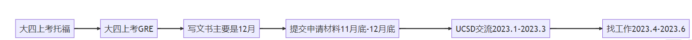

# [US]19-信息-周华鹏-UW

**小标题 : 先不出了**

**个人基础背景**

| | |
| --- | --- |
| **东大GPA** | 4.12/4.8 90.92/100 rank: 26/236（前5个学期） |
| **出国GPA** | 3.84/4.0 89.6/100 |
| **TOEFL/IELTS** | TOEFL 总分：99 阅读：28 听力：22 口语：21 写作：28 |
| **GRE** | 语文：153 数学：165 写作：3 |
| **科研** | SRTP 国创 IEEE PIMRC, IEEE BlackSeaCom 两篇三作 |
| **竞赛** | 高数竞赛校一省一国一,电设省二 |
| **交流经历** | 大四寒假UCSD(SAF)交流一个学期（在申请后） |
| **实习经历** | 无(最心痛的部分) |
| **荣誉** | 信息学院的孙庆云奖学金 |
| **推荐信** | 三位东大老师 |

**录取结果**

| 学校 | 项目名称 | 录取结果 | 个人评级 | 时间线 |
| --- | --- | --- | --- | --- |
| Gatech | ECE-MS | REJ | 冲刺 | 12.15 |
| TAMU | MCS-MS | REJ | 平级 | 1.15 |
| UCSD | CS76 | REJ | 彩票 | 12.15 |
| UCI | Netsys-MS(Networked System) | AD（无奖) | 平级 | 12.15 |
| UCI | MSWE-MS(Master of Software Engineering) | AD（无奖) | 平级 | 12.15 |
| UCSD | ECE-MS-EC93
(Machine Learning & Data Science) | AD（无奖) | 平级 | 12.15 |
| Wisc | ECE(Signal Processing & Machine Learning) | AD（无奖) | 平级 | 12.15 |
| UW | EE(day time) | REJ | 冲刺 | 12.15 |
| UW | EE-PMP | AD（无奖) | 保底 | 4.15 - 5.16 |

**申请季时间线** 

**感想**

个人经验有点混,大佬勿看勿怼。

### 关于GPA

- 出国GPA和学校的GPA计算方式不太一样 85分4.0,均分更是采用算术平均分,所以和保研的GPA优化目标也是不同的,我比较晚意识到这个问题。可以行策体育这种分刷高一点,这些和6学分的高数系数是一样的。(其实我个人感觉这个应该算是友好的算分,可以比较轻松的拿均分的高分,但我以前想着保研,就出现了高数满绩体育60的情况,两种计算方式(加权和算术)算出来的分差别很大,反而被这个规则坑掉了,怪我不怪学校)
- 再好好想想上一条,出国绩点和均分更要求的是门门课不低,而不是分数很高的课比较多,想清楚了应该可以事半功倍。有点像高考数学最后一题分数和前面的题一样的,难度不一样,但没有人会在乎你最后一题做出来没有。参透游戏规则很重要,我以前想保研,信息有专业选修课不算保研成绩,我直接75,后来打算出国这个也算成绩…
- 如果想要很高的分数93+ 3.95+ 那还是尽量要做到完美的,可以看看寒石的建议。以下方法可能不会适用。
- 信息的考试感觉做往年题无敌,毕竟题目也不会怎么换,例子:我记得我在考信号前两三天z变换是什么都不知道,一直到考试前一晚上也不知道这在讲啥题目咋做,我当时就很急啊怕挂科,然后我就不管了直接找了往年题和一本题目答案书,啥不会直接做题然后翻答案然后再看不懂再去看概念再做题。最后我直接通宵了一个晚上,考试不仅没挂科还拿了90多吧(虽然我关于信号还是什么都不会。我感觉这种课**exam driven learning** 能省很多时间,最后往往成绩还不错,所以多做往年题。我想了一下背后的原因,平时上课和考试之间是有很大的gap的,一遍一遍学习只是让自己的模型更加general.而exam driven learning是不断拟合训练数据上,理论上考真本领应该会出现啥不会(过拟合)现象,但东大的考试训练数据和测试数据是***相同的数据。***
- 关于往年题,电子的同学有福了,寒石的repo真的很详细https://github.com/preminstrel/awesome-seu,唯一的缺点是这个repo跟我是一届的,信息应该也有群聊资料之类的。
- 我个人感觉GPA的边际效应很低,曾经我也将GPA奉为圭臬,但我觉得不申请顶级项目3.8+应该都已经足够。可以把时间用在更有意义上面的事,solid的科研,实习或者任何自己想干的事。信息仔对这个很狂热不是很能理解

### 关于语言

- 托福GRE可以参考其他学长学姐的笔记
- 可以提供的dp是我的GRE是裸考的(开考前题型都不知道),感觉GRE的投资回报率很低,不妨把quant刷完裸考一次,说不定就320+了

## 关于项目

- 袁一啸学长说的很详细,可以认真阅读一下
- 我申请的项目都很便宜
- 后悔没有申请CMU, CMU牌子还是很顶级的, 而且最近了解下来也不会特别贵

### 关于信息(忠言逆耳)

一些关于信息的吐槽(IC最近情况很好,与下述无关,真的很热爱且读博的不用看并且当我没说):

- 当我看到软件有一年时间的实习时,当我看到计软智打包去intel实习时,当我看到计软智学生各种fancy的开源项目及创业时,当我看到哪怕是今年的寒冬计软智的就业情况依旧比信息好的多的多时,只想问一句,信息人,你为何不生气?这已经是现象了,不是某些个体的问题了,而是学院学科的,可以上linkedin看看信息的学长学姐现在在从事EE还是CS。
- 于此同时,信息人还在吭哧吭哧卷绩点少了几分就完蛋,信息人还在努力的再把自己的报告再多写几页,信息人学一堆与就业毫无关系的破专业课信号与系统电磁场,信息人做一堆除了保研加分没有意义的竞赛,信息人丝毫没有关注就业市场,信息人的代码功底和我以前的机械人差不多,信息人还在沾沾自喜自己的优势学科嘲笑计算机时,信息人保研还在卷通信这个夕阳方向,我只觉得这一切都荒谬的可笑。
- 通信在美国已经没什么人做了,有几个泰斗都早已转行,这个领域几乎只剩华人了,你们玩吧.AI发展已经如此迅速了,请不要再用全连接网络辅助通信了,多用GPT4.信息看不起的计算机每年招聘都比信息好太多(哪怕今年),通信除了Huawei几乎没人要(Huawei招计算机的可能还更多),计算机变土木前也一定在通信变土木之后。
- 信息的课很烂,对软件相关就业毫无帮助,信息和计算机差不多这种话都是假的,东大信息和硬件强相关,大概物理层及以下吧。
- 想不通为什么信息保研90分计软智只需要85分(同层次学校哈工大之类计算机才是卷飞的那一个,电子信息都是混子,而这一切只是由于和学生没什么关系的东大电子信息评估很高,计算机很低)

### Miscellaneous

- 我个人认为一个人的发展决策是最重要的,其次毅力,其次聪明。
- 决策对于我来说是最难的事情但我觉得也是最有价值的事情,我做了两次错的选择,一次是高考进了机械,二是转系去了信息和两次正确的选择,一次是机械转出,二是转计算机。由于做两次错误给我带来的痛让我深知这比其他重要性明显要高,做的好不如选的好。但这部分是真的难,怎么选真的很难说,找到自己的热爱和行业前景发展方向我现在也还在慢慢摸索。一个关于决策常见的误区是bar高等于好,在高考志愿上应该体现的最多,原因不再赘述。一个关于决策有用的链接: [https://coolshell.cn/articles/8790.html](https://coolshell.cn/articles/8790.html)
- 其次坚持的真的很重要,坚持可贵,这个道理自己亲自走过才明白.我在想我大三下要是坚持能找实习现在的情况该多好,哪怕是一般的实习,大四下没有坚持下去找工作现在该怎么办。坚持可贵,很难得,坚持下去会有柳暗花明的那一刻出现,很朴实但深刻的道理。并且时间线拉长,这个的作用会越来越明显,找到合适的方向后在未来我也想一直坚持下去。
- 聪明能让一个点到另一个点前进的更快,但我感觉除此之外也没有别的用了,重要性最低。例如一个高中里的小天才大学选了天坑照样是寄,这样的例子数不胜数。
- UCSD的交流还是不错的,SEU补助很多,可以大胆尝试,还有五年的F1签证,具体可以在下面这个链接看到我的体验 [http://huapengzhou.life/assets/周华鹏_加州大学圣地亚哥分校_2023年1月到2023年3月.pdf](http://huapengzhou.life/assets/%E5%91%A8%E5%8D%8E%E9%B9%8F_%E5%8A%A0%E5%B7%9E%E5%A4%A7%E5%AD%A6%E5%9C%A3%E5%9C%B0%E4%BA%9A%E5%93%A5%E5%88%86%E6%A0%A1_2023%E5%B9%B41%E6%9C%88%E5%88%B02023%E5%B9%B43%E6%9C%88.pdf)
- 多找19 -AI -袁一啸聊天
- 上海交大这个自救指南 [https://survivesjtu.gitbook.io/survivesjtumanual/](https://survivesjtu.gitbook.io/survivesjtumanual/) 一度让我萎靡不振,觉得没有意义,不过在更能认清这个大学,这个世界的真相后,能够更加积极的面对生活(罗曼罗兰
- 我个人放弃出国offer工作了,有兴趣工作的可以和我唠唠

我其实讨厌很重的说教味,只是一些建议,可能和其他作者比起来很激进,也欢迎批评讨论。无论去哪,都希望大家在自己的游戏副本里玩的开心,享受当下。

## 联系方式

欢迎学弟学妹加我联系方式(微信为主):

Wechat: bubbergun_shop

QQ: 2878528267

Email: zhouhp.me@gmail.com
