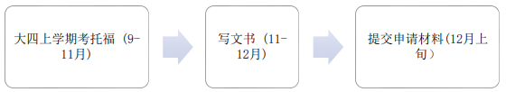

# \[US\]19-信息-王旭康-UW-EE PMP-MS

**gap year选手（24 fall入学）**

## **个人基础背景**

|                 |                                              |
| --------------- | -------------------------------------------- |
| **出国GPA**     | 3.79/4.0                                     |
| **百分制均分**  | 88.33/100                                    |
| **TOEFL/IELTS** | 总分：94 阅读：25 听力：25 口语：22 写作：22 |
| **GRE**         | 无                                           |
| **科研**        | SRTP国创（组长）+专利                        |
| **竞赛**        | 无                                           |
| **交流经历**    | 大四寒假UCSD冬季学期交流（申请时无用）       |
| **实习经历**    | 无                                           |
| **荣誉**        | 无                                           |
| **推荐信**      | 东大任课老师+SRTP导师                        |

**录取结果**

| **学校** | **项目名称** |  **录取结果**   | **个人评级** |        **时间线**         |
| :------: | :----------: | :-------------: | :----------: | :-----------------------: |
|    UW    |    EE-MS     | REJ（降录 PMP） |     冲刺     | 12.10 Submit, 3.11 Reject |
|    UW    |  EE PMP-MS   |       AD        |     平级     |        3.11 Admit         |

## **申请季时间线 **

## **个人感悟**

##### 出国缘由及语言准备

我从小就在语言学习这个问题上不太擅长，因此一直没有考虑出国留学（为了逃避学习英语），六级也仅仅450分飘过。大学前三年一直都在按部就班的佛系学习，打算争取保研或备战考研，如此平静的生活持续到了22年7月底。随后，思想上的挣扎让我决定换一条发展道路。

8月份的我病急乱投医，报名了xdf为期4周的托福课程，在新街口上课。事实证明这样的课程并没有多大帮助（也许只是对我），8月底结课后的模考只考了78分。

9月份的我一直在刷TPO，9月27日的第一次托福考了93分，属于超常发挥，阅读虽然没怎么看懂，但蒙对了太多。

随后的10至11月上旬，我也一直在刷TPO。11月12号的第二次托福考了94分，虽然分数只提高了一分，但这次属于正常发挥，我也无奈的接受了哈哈哈。

##### 择校过程

随后便是纠结选校。其实也没有太过纠结，因为当时已经有了gap year的打算，大不了第二年接着考托福和GRE。于是完全抱着赌一把的心态，只选择了UW作为申请的学校。

选择UW的原因有三点，一是托福卡92以及无需GRE（这对我非常重要），二是排名说得过去，三是西雅图地理位置好，硕士项目的设置也对就业有帮助（本人坚决不搞科研）。这里要对不了解的同学说明一下，UW的EE项目实际等价于其他学校的ECE项目，学院的名称前几年改成了ECE，但是学位名称没来得及改，还是EE。

随后就是按部就班的准备文书、推荐信和CV，这里要吐槽一下UW的文书。UW EE PHD和MS的文书要求是统一的，这意味着MS申请者也需要在文书中详细阐述自己的申请动机、研究经验和学术背景，并包含对感兴趣的导师的研究领域的理解，甚至在申请系统中要选择自己的目标导师，让他们成为后续录取过程的一部分决策者。

这里谈一下UW的传统MSEE和MSEE PMP项目的区别，详细介绍可以参阅地里的这篇帖子<https://www.1point3acres.com/bbs/thread-979569-1-1.html>。简要来说，传统的MSEE项目更偏向科研，可以选择Thesis Option或Coursework Option，对科研有兴趣的话可以尝试转博。而MSEE PMP项目只有Coursework Option，且是下午到晚上上课，纯就业导向的项目，后续基本无法读博。顺带提一嘴，两个项目的学位完全一样，都是MS-EE学位，两者的学费和时间也基本相同。从今年的申请数据来看，传统的MSEE项目的bar有些飘忽不定，基本没见到几个录取的，不太清楚是什么原因。PMP项目基本是点击就送的状态，大家可以拿这个做保底哈哈哈。

##### UCSD冬季交流

因为已经做好了gap year的打算，所以在大四上学期学托福的同时，报名了SAF的UCSD冬季交流项目，希望可以在来年提升自己的竞争力。

交流经历就不展开说了，这里主要谈谈个人收获以及交流项目的实际价值。因为我参加的是学期交流，不是暑研项目，说白了等于去UCSD上10周课（UC系学校一学期10周，一年4个学期）。

从学习知识的角度来说，意义不大。虽说美本的教育质量确实比陆本强，但是交流时间太短，能掌握到的知识技能总体有限。

从提高背景的角度来说，确实有意义，但具体作用因人而异。从学期交流项目中提高背景，无非就是拿到任课老师的推荐信和取得好成绩。从美本的课程难度上说，只要认真对待，SEU的同学想获得高绩点并不难（个别变态课程除外），这可以让任课老师答应你的推荐信请求。但是，从我交流的UCSD来看，因为是公立学校，每节课都有100来号人。如果你只是一个认真上课做作业的学生，老师基本上是记不住你的，任课老师只知道你是个成绩优秀的学生，最后给你的推荐信也大概率是个平推，不会有太多出彩的地方。当然，如果能给老师留下深刻的印象，那推荐信的效果自然另说哈哈。

##### 关于gap year

选择gap一年其实综合了多方面的考量，其中对我影响最大的是在UCSD交换期间和许多优秀的学长学姐的沟通交流。US最近的找工形势的确不容乐观，即使拥有足够优秀的背景也不一定能获得工作机会，有时甚至需要运气成分才能拿到面试。因此我便萌生了在国内先工作一年，明确未来的发展方向（转码or not），同时积攒工作经验，顺便对US的就业形势保持观望的想法。

次要因素是在UW出录取结果前，国内春招已经开始，害怕在家啃老的我也参与到了其中，有幸拿到了一些offer。在参与春招的过程中，我深深的明白了学历（学校）只是敲门砖，存在的意义只是帮助通过第一轮的简历筛选，后续的多轮面试完全看个人的真实实力。

最后也要归功于UW宽松的defer政策，使我可以将23 fall入学的offer推迟到24 fall。

##### 写在最后

大家有想问的问题的话，都欢迎联系我，无论是关于UW还是关于gap year找工，我都会尽力去解答大家的疑惑。我的QQ号是2521247874，加好友请备注来意和姓名，谢谢。
