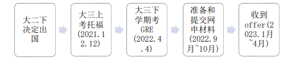

# [US\]19-吴院-宣瑞泽-UCSD-EC77-MS

**向海风许愿，在山海相见**

## **个人基础背景**

|                 |                                                         |
| --------------- | ------------------------------------------------------- |
| **出国GPA**     | 3.75/4.0                                                |
| **百分制均分**  | 88.58/100                                               |
| **TOEFL/IELTS** | 总分：104 阅读：27 听力：23 口语：26 写作：28           |
| **GRE**         | 语文：155 数学：169 写作：3.5                           |
| **科研**        | 两段校内科研，一段校外科研，三个课程project，一篇水论文 |
| **竞赛**        | 美赛F奖，大英赛国二等                                   |
| **交流经历**    | 非专业相关的UCLA线上交流                                |
| **实习经历**    | 无                                                      |
| **荣誉**        | 校长奖学金，三好学生等                                  |
| **推荐信**      | 两封东大教授推荐信，一封国外教授推荐信                  |

**录取结果**

| **学校** | **项目名称** | **录取结果** | **个人评级** |         **时间线**          |
| :------: | :----------: | :----------: | :----------: | :-------------------------: |
|   UCB    |  EECS-Meng   |     REJ      |    纯彩票    | 10.12 Submit,   4.13 Reject |
|   Duke   |    ECE-MS    |     REJ      |  彩票偏冲刺  | 10.14 Submit,  3.20 Reject  |
|  Gatech  |    ECE-MS    |     REJ      |  彩票偏冲刺  | 10.12 Submit,  4.15 Reject  |
| Cornell  |   ECE-MENG   |  AD（无奖）  |  平级偏冲刺  |  10.12 Submit,  3.10 Admit  |
|   NWU    |    EE-MS     |  AD（无奖）  |     平级     |  10.12 Submit,  2.3 Admit   |
|  Upenn   |    EE-MSE    |  AD（无奖）  |     平级     |  10.12 Submit,  3.22 Admit  |
|   UCSD   | ECE-MS-EC77  |  AD（无奖）  |     平级     |  10.12 Submit,  3.6 Admit   |
| Columbia |    EE-MS     |  AD（无奖）  |     保底     |  10.12 Submit,  2.9 Admit   |
|  Umich   | ECE-NCIS-MS  |  AD（无奖）  |     保底     |  10.12 Submit,  2.27 Admit  |
|   USC    |    EE-MS     |  AD（无奖）  |     保底     |  10.12 Submit,  1.13 Admit  |
|   NUS    |    EE-MS     |  AD（无奖）  |     保底     |  12.11 Submit,  3.30 Admit  |
|   NTU    |    CE-MS     |  AD（无奖）  |     保底     |  11.19 Submit,  1.5 Admit   |

## **申请季时间线**

## **个人感悟**

**出国想法的萌芽与坚定**

我是在大二下开始决定将来要出国读研的。从大一上的状态低迷到大一下的渐有起色再到大二的稳中求进，对于未来的规划其实我本人也是不那么坚定的。我自己其实对于国内读研还是国外读研都不拒绝，只要有学上就行嘞。在我得知了我的背景可以在国外申请到更好的学校时，我毅然选择了出国读研。虽然这条路可能有更多的不确定性，但是我可以看到比别人更多的风景，同时国外的教育资源也更为丰富，因此我非常坚定地选择继续走下去。在大环境以及相关政策的扶持下，我做一个大胆的预测，24届应该出国的人会比我们这届多一些。当然我是十分鼓励有相关条件和背景的同学走出来看一看的。

**语言准备**

我本人的托福和GRE都是家考完成的。但是由于后续应该各地会逐步恢复线下考试，因此这一部分有关于线上考试具体细节的心得体会我就不再赘述了。有关于具体单项的准备，首先我就说说口语和写作（和一般的国内考生情况相反，我的听力和写作分数比较抽象，硬是把优势和劣势互换了）。对于口语，建议每天都要练，多说多读，利用真题训练，首先听完材料之后在纸上迅速写下要表达的关键词，而且要用手机上的计时器严格卡死时间。同时在之后的反思总结环节，记得将当前话题的素材收集到自己的资料库里面。在训练了一定数量的题目后，将类似话题的归纳到一起，形成几个大类，比如教育类，生活类，工作类等等。这个素材库具有很强的利用价值，不仅仅是在口语，在写作里也能发挥极大的作用，可以形成几个段落的主旨。我还很清楚地记得当时在考前的一段时间，我每天都会花上两到三个小时进行集训，先做阅读和听力，然后到教室外面走廊里找一个座位训练口语。对于写作，一方面我会利用之前提到的素材库确定主要的论点，另一方面还是利用真题中的金句（比如常用的开头和结尾，偶尔还可以利用辩证的思维写作，我就很喜欢There is a prevailing notion that… More and more people hold the belief that… Some people may prefer… However from my point of view, … is more convincing.这一句，帮助了我无数篇作文的开头hhh），总体上也可以分成几个大类。关于打字速度我觉得一般都不成问题，只要你思路够，素材够，文思泉涌之下打字速度自然会上来的耶。

**关于中介**

关于是否找中介的这个问题因人而异。如果你是那种全能型人才，在兼顾校内学习的同时，又可以对各种准备材料如数家珍，那建议DIY。如果你是只能集中精力于一件事，自己手边的事情还较多，比如需要全神贯注于提高绩点，加强自己的软背景等而没有精力准备材料，那建议用金钱换取时间。但是找的时候也要注意甄别，像之前群里提到的一些中介比较差，建议避避雷。我个人找了一个比较专业的中介，总体体验下来还是比较不错的。不过尽管选了中介，还是要做到自己的事情自己做主，还是要操一些心的。在一些关键的节点比如在最终的选校名单确认，网申最终提交之前的信息确认，后续offer的确认，以及DS-160的官网提交确认，面签预约确认都是需要认真检查自己信息的，切不可将主动权拱手相让。

**申请流程及有关事项准备**

整个的留学申请主要分为以下几个流程。首先是提升自己的背景，因此有留学规划的同学要尽早地认识到这一点，Admission Committee在审核材料的时候会考察多个指标，建议参考下面这两篇帖子：

<https://www.1point3acres.com/bbs/thread-463109-1-1.html>

<https://www.1point3acres.com/bbs/thread-581428-1-1.html>

然后对于fall入学的同学一个比较理想的timeline是需要在大四上开学之前（也就是申请季之前的八月份左右）进行前期调研，确定选校和项目的名单，就读体验方面可以参看我们之前的飞跃手册或者是地里的有关讯息；然后大部分学校会在十月份之后开启网申，截止时间早的到十二月份，晚的会到一二月份，这个提交时间因人而异，赶在ddl之前就行；推荐信的提交一般可以在提交网申之后单独提交，因此记得尽早联系推荐人，有的老师是直接让你自己提交，但是比较正式的方式应该是让老师自己提交（我的某位推荐人跟我开视频会议然后一边evaluate我，一边填写，还是很刺激的hhh），之前出现过一种情况就是committee那边会比对applicant的申请IP地址和recommendation letter的提交IP地址，如果重复了就比较麻烦，也会被怀疑造假，所以还是尽可能避免这种情况；而且注意作为被推荐人我们要选waive my right to view the recommendation letter，不然会被committee怀疑成分；offer的集中发放会在二三四月份；在确定去向之后对于美研的同学尽早开始准备签证材料（尤其是I20的申请，我本人在3.5收到UCSD的offer后立刻accept然后在3.21申请了I20，只用了三天就审核通过，然后立刻预约了4.27的面签。而直到现在还有UCSD的incoming students没有拿到I20而无法确定面签时间）和宿舍（一般是根据申请时间排waitlist，一般资源很紧缺，校外的价格会贵上比较多），不要拖延，不要拖延，不要拖延！！！

**关于排名与择校**

这一部分我相信也是困扰很大一部分同学和家长的问题（感觉主要是家长，刻板印象了属于是，无意冒犯(╥╯^╰╥)）。当然如果你是家长口中“别人家的孩子”，手握顶尖学校offer，精英中的精英，那下面可以省略不看。在许多长辈的印象里，Ivy League\>\>其他，这确实是符合直觉的认知。在选校的时候，很多同学会在家长或者是某些长辈的建议下选择所谓排名尽可能靠前的学校。这种选择无所谓对错，以下仅代表个人的观点。而剩下绝大一部分其实都是各有所长的，无所谓孰强孰弱，特别是还有在某些领域有绝对建树的神校。更何况，不同排名的参考标准不同，除了超级牛校，剩下大部分学校的排名都会以难以捉摸的姿态跳跃。因此，我觉得最重要的还是依据专业契合度选校，排名只是一个“参考”的指标。希望这个因素不要过于困扰某些同学。

**寄语**

作为23届毕业生的一份子，我想说的是我们的大学生活充满戏剧性。先是在大一下的时候迎来了新冠疫情，被迫在家停留了一个学期；在大四上的时候随着疫情状况的基本可控，社会各界的解除封控，我们总算再次体会到了正常的大学生活。可以这样说，我们这一届的所有人，在大学本科的四年时光里，既见证了疫情的兴起，也目睹了疫情的消散。可能有许多同学因为这场疫情的出现，被迫暂时性地改变了自己的人生轨迹，亦或是被打乱了原有的计划。但每个人都随着这场疫情而成长，不断地在自己的道路上发光发热。

还记得自己一开始步入东南大学的校园时，还是一副稚气未满的模样。当初的自己背着行囊走出家乡，第一次来到异地求学，身边的一切都是那样陌生和未知。而现在，这陪伴了我四年的大学校园就好似我的第二故乡一般和我关系亲密。当时大一的我又怎能够想到，四年之后的我选择了大洋彼岸的求学之路。再次地，我选择了更为遥远的异国他乡。人生充满了选择，存在着很多分岔路口，有时难以捉摸，有时又充满巧合，有迹可循。可能在我下定决心出国的那一刻起，我心底已经深深地向海风许下了心愿，寄希望于山海之外，和将来更好的自己相遇。

Last updated: 2023.7.27

VX：wxid_warnxj24c1kq22
