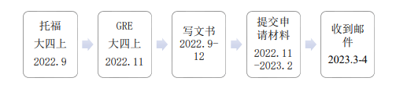

# \[US\]19-吴院-潘欣-ucsd-ec93-MS

**ddl选手的申请季：赶ddl 并成功**

## **个人基础背景**

|                 |                                              |
| :-------------- | -------------------------------------------- |
| **出国GPA**     | 3.75/4.0                                     |
| **百分制均分**  | 89.36/100                                    |
| **TOEFL/IELTS** | 总分：99 阅读：29 听力：27 口语：21 写作：22 |
| **GRE**         | 语文：157 数学：169 写作：3.5                |
| **科研**        | 校内科研，无产出                             |
| **竞赛**        | 国三\*1，省三\*1、省二\*1、校奖若干          |
| **交流经历**    | UCLA线上水交流                               |
| **实习经历**    | 中厂实习一段，申请时半年                     |
| **荣誉**        | 无                                           |
| **推荐信**      | 校内教授\*2、实习boss\*1                     |

## **录取结果**

| **学校**  |   **项目名称**   | **录取结果** | **个人评级** | **时间线** |
| :-------: | :--------------: | :----------: | :----------: | :--------: |
|    UCI    |       MSCS       |     REJ      |     保底     | Ddl 12.15  |
|   UCSD    |       CS75       |     REJ      |     彩票     | Ddl 12.21  |
| Dartmouth |      CS PHD      |     REJ      |     彩票     | Ddl 12.15  |
|    CMU    |     ECE-MSAI     |      AD      |     冲刺     |  Ddl 1.15  |
|   UCSD    |       EC93       |      AD      |     平级     |  Ddl 12.7  |
|   UIUC    |   MCS(course)    |     REJ      |     彩票     |  Ddl 1.15  |
|    NUS    |  engineer-MSCE   |      AD      |     主申     |  Ddl 3.31  |
|    USC    |       MSAI       |     REJ      |     主申     | Ddl 12.15  |
|    CMU    |    INI-MSAIE     |     REJ      |     彩票     |  Ddl 1.15  |
|   UMICH   | ECE-Meng（DSML） |      AD      |     主申     |  Ddl 1.15  |
|    NWU    |       MSCS       |     REJ      |     主申     |  Ddl 2.28  |

## **申请季时间线 **

## **个人感悟**

整个申请季走来，没有报班自学语言+DIY，托福和GRE还是集中在大四上才考出，可以说整个过程充满了极限ddl，但最终还是顺利度过并取得了较为满意的结果。但我中途也不乏焦虑和自我怀疑，也多次翻阅前几届的飞跃手册对比自己的情况，一些同样在大四才考出语言成绩的学长学姐也给我带来了一丝慰藉，所以在最前面我想对可能还有很多目标未完成（还没有写好文书、没有考出语言）的学弟学妹们说，不要焦虑，要相信自己的潜力，在大四才考出语言并没有晚到无法挽回。

不过如果你早早就有了出国计划，并且有着充分的执行力，那以下是个人通过自己的反例总结的一点时间线参考：

**多早都行——大四上10月份前：**收集选校信息

**大三一整个学年：**托福/雅思，GRE

**大三结束：**开始写文书（ps、sop、推荐信等）（如果你正在经历一些项目或者竞赛，可以不着急定稿，先完成一个框架）

**大四9月到10月：**文书定稿

**大四12月到来年3月：**进行申请系统填写。在收集选校信息时，就可以记录每个申请的截至时间，申请一个项目的过程可能会持续一个星期（本拖延症申请CMU的INI项目用了接近两个星期），在你实际进入系统申请之前，你不知道学校要你填多少东西（再次点名CMU申请系统，要填的内容非常多，还有video essay），而且每个学校对于ps和sop的要求不一，或者有额外要求，所以推荐最晚在申请截至日期前两个星期开始填写申请系统，给自己留下足够的填写时间。

##### **语言准备**

对于托福，我认为模拟考是很重要的，不需要模拟考非常多次，但至少需要有2-4次，以便熟悉整个流程。从我自己的经验看，练习时零零散散做的题和考试时做完一整套的体验是完全不同的。第一次托福考试前我只进行专项练习，没有完整模拟考过一遍，所以考的非常之差。准备第二次考试时，完整练习了多套，成绩就比较看的过去了。关于如何获得模拟考试，有钱的直接上官网，想省钱的可以上万能的淘宝，有些店铺的模拟软件做的还算可以，卷子很多套，操作也和正式考试差不多，这里就不具体点出店名了，一搜就有。

GRE考试做重要的就是背单词，单词至少需要背三轮。作文也需要多练，3.5分是一个不会拖后腿的槛。

##### **推荐信问题（很重要）：**

国内存在的一个现状就是教授不一定愿意自己写推荐信，在自己撰写时，需要注意的就是不要用相同的语气、格式，不然很容易被发现。

如果教授把邮件转发给你让你自己提交推荐信，**在提交推荐信时，一定要找不同的电脑提交！**据我所知，达特茅斯学院23年更新了ip检测系统（一位教授提供的信息，非常实锤）。就我的感觉来看，除了达特茅斯，其他学校并没有增加这种检测，但这种事情谁能说得准，搞不好下一年就增加了。所以在提交推荐信时一定不要嫌麻烦，能让教授自己提交的尽量让他们提交，自己交的时候一定要用不同电脑。

##### **如何填满文书？：**

虽然就我阅读飞跃手册的感觉来看，很多人都会描述经历时写一个“水竞赛”，“水科研”、“感觉申请时没用”。但是，不是每一个人都能用paper把自己的ps填满，我在申请时没有paper，但我认为我的ps/sop/cv在申请的过程中是起了一定作用的。那么如何将文书写的充实，就需要你有自己的经历，包括但不限于：实验室打工、srtp、竞赛、实习、科研产出。（写推荐信时也需要写你在mentor的监督下做了啥）。所以，刷GPA很重要，但是当GPA提升的差不多时，从3.9到3.95的作用已经不多了，可以从软背景入手，多去参加一些有用的实习、竞赛等，让自己在写文书时有内容可写。

在写文书时，可以多参考别人的分享，如果想要得到native speaker的润色，可以在一亩三分地上找一些别人推荐的fiverr文书服务者，比中介省钱也有用多了。现在也可以使用ChatGPT等。

##### **结语（终于在ddl前一天写完了！）：**

准备、申请、等待，每个过程都漫长而未知，但在尘埃落定前，一切皆有可能。祝各位学弟学妹都能去往想去的地方，见到想见的风景。

**联系方式：**

QQ: 1360233405

VX: RhymeE_E

有什么问题都可以前来询问，也有收集的资料可以被继承，欢迎联系！
