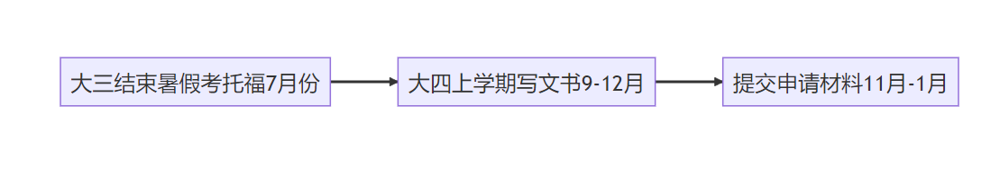

# [US]19-电气-崔筱曼-UCLA-ECE-MS

“有时候，选择不是为了更好的结果，而是我们选择成为什么样的人的过程”

**个人基础背景**

| | |
| --- | --- |
| 东大GPA | 4.3/4.8（大约） |
| 出国GPA | 3.94/4.0 |
| TOEFL/IELTS | 总分：105 阅读：29 听力：27 口语：23 写作：26 |
| GRE | 无 （←懒鬼本鬼） |
| 科研 | 几段简单且水且无关的科研（硬要说就是两段电气向SRTP+一个跟着学优生导师做的能源规划+一个电力电子向器件研究） |
| 竞赛 | 感觉国外不太认这个，高数国一，大英国二 |
| 交流经历 | 大四下去了爱丁堡大学，但那时候申请已经结束了，没用上 |
| 实习经历 | 约等于没有 |
| 荣誉 | の，国奖？ |
| 推荐信 | 东大教授*3 |

**录取结果**

| 学校 | 项目名称 | 录取结果 | 个人评级 |
| --- | --- | --- | --- |
| UTAustin | ECE-MS | REJ | 彩票 |
| Upenn | MCIT | REJ | 平级偏彩票 |
| Gatech | ECE-MS | REJ | 平级偏彩票 |
| UCLA | ECE-MS | AD（无奖) | 平级偏彩票 |
| Rice | MCS | REJ | 平级偏彩票 |
| Cornell | ECE-Meng | AD（无奖) | 平级 |
| Duke | ECE-MS | AD（无奖) | 平级 |
| UBC | ECE-Meng | REJ | 保底 |
| Waterloo | ECE-Meng | REJ | 保底 |

**申请季时间线**

**个人感悟**

### 出国原因-又名心路历程

大三下学期之前认为自己一定最后走保研了。因为认定自己会走保研的路，咨询了很多保研的学长学姐，其中有一位给了我不小的冲击。带给我冲击的那位学姐很厉害，保研了清华，我在询问学姐未来的规划时，学姐告诉我，她打算去电网。并不是说电网不好，只是我就想到，就算我摸到了保研的天花板，就算我也能够保研清华，我也大概率是去电网。这个结论一方面是通过咨询很多电气专业的老师，老师们的结论（电网确实是女生在国内很好的出路），另一方面也是自己总结认可的。那么进一步想，如果我未来会去电网，那大概率会尽力留在江苏电网（江苏人不出省老毛病了）。但是如果我留在江苏电网，那么东南大学本身就是我最好的选择，不论是实力还是地理位置，那这样之后保研拼一把也没那么必要了。

冲击在前，转机在后。选择改变是在一次日常的宿舍聊天中（(*^_^*)），我大学的好朋友问我有没有想过出国。当时的我愣在了那里，因为说实话，从来没想过。这一句话让我脑海中的某个阀门被刷的一下打开，从那以后，我的想法越来越偏向出国。

所以，和有些朋友一开始就明确出国不同，我算是“半路出家”。但是就像我在一次演讲中听到的一样，“有时候，选择不是为了更好的结果，而是我们选择成为什么样的人的过程”。我从小就是心态极好、傻乐出头的人（老师家人官方认证哈哈），但是在知道自己要保研的那段时间，迷茫与日俱增，可能太了解自己不想要什么样的生活（没经过社会毒打maybe），当明知自己的未来很可能不是自己想要的时，就会产生痛苦。

### 选择出国之后-准备工作之背景

有出国想法之后，就是慢慢了解的过程，了解自己能申请的学校，申请学校还缺少的东西材料等等，以及还需要哪些努力。

出国首先就是英语成绩，我偏向美国，所以主要准备的托福。准备的时候主要是报了一个外面机构的托福英语学习班，课程的质量内容一般般，就是讲讲方法论，讲讲题目，对我主要作用在于强迫我每周都拿出时间来复习准备。其实最后考的很匆忙，特别是考试的日子还在东大期末考试周。所幸我人品爆发，听力阅读还不错（相较我平时的成绩），考到了可以用的成绩。不过前辈们说的很对，还是早点准备为好。

学习成绩GPA我还可以，除了一个血的教训！在这里给大家提个醒，就是水课一定要注意啊！！一想到我60的形势与政策我就心绞痛OMG。然后，我自己总结有一些提高分数的Tip，比如课堂刷脸多去问老师问题；实验课程、项目课程等等如果你想拿高分，可以试试直接问老师想拿优需要做到什么程度；把书上例题多看一看（这一点是观察我们学院一个顶级GPA大佬发现的，我做的并不是很好）。

其他的准备比如科研、实习、出国交流，我都很一般，感觉也没什么发言权，不过通过和大家伙交流，感觉有几项作用非常大。第一就是目标院校或者高层次国外学校的科研实习，这点也是让我非常遗憾的一点（哭泣表情），具体体现在没关注邮箱，错过面试时间（听上去是不是蠢爆了哈哈哈哈哈哈（声音减弱，由笑转哭/(ㄒoㄒ)/~~））。不过这种项目价格都不便宜，要是能得到资助是值得好好把握的机会，大家可以多关注一下。高质量的科研实习什么的作用是很大的，要是大家没有国外科研的机会，真的鼓励大家多去和校内老师们接触接触，最好是能找到那种充满干劲、亲近学生、愿意指导学生的好老师。

### 选择出国之后-准备工作之申请

首先就是关于中介，虽然飞跃群里叫大家不要找中介，我亲身感受也是中介作用不大。但是很多同学在申请季都会稍微有点心虚没底气，想找个中介安心一点，其实也无可厚非。我当时选了很便宜的中介，因为不放心，从选校到文书材料到网申，还是我自己下决定操刀。因为这是我们大家自己的事情，大家一定要认真对待，对自己负责（毕竟有中介给错信息、填错网申之类的先例，钱事小，申请事大）。

大家会发现选校的时候我选了很多CS项目，我承认当时是有点想转码的，不过通过大四下的出国交流，我现在深刻意识到自己代码能力的差劲👎。其他我主要借鉴了往年几届的飞跃手册，前辈们的经验介绍都很有价值，再者可以去一亩三分地看看，有很多项目体验贴。

之后是文书部分。申请过程中，我的文书只能算作中规中矩不出错，同时也不出彩，真心感觉写个人陈述什么的真太耗脑力了，这里拥抱每一个自己写文书的朋友。真个过程就是先准备简历，用内容填简历模板；再写推荐信，推荐信根据模板，明确每一段的内容和作用，自己写完修改，修改完给老师看了签字，（在这里非常感谢一位大学时和我关系很好的老师，老师几乎是自己写完了推荐信的内容，情真意切，写了很多上课、实验、做项目的细节，太感动了）；之后是重点工程个人陈述，这块我是挑了一个还挺想去的学校，先按这个学校的招生倾向写SoP(个人陈述)，写完修改完善，再根据不同学校修改。其实你会慢慢发现，越写到后面改得越好，所以前辈们说的没错，应该把自己重点pick的学校放到后面写。

再之后是网申，包括去学校申请系统填写申请、托福/雅思送分、WES送分（很多不要求我也没送）、GRE送分（需要可送）。全部填完后就差不多完成了~可以放开了耍(*^_^*)。

**最后**

（乖巧.jpg）

QQ: 3226563073

微信：sjh18052927180
